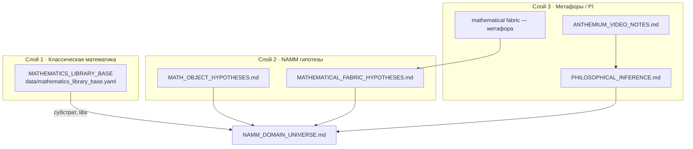

# База классической математики · Mathematics Library Base

**Roman Kuznetsov · NAMM research program**

Машиночитаемый каталог **классических разделов математики** и связанных Python-библиотек PyPI. Это **не** NAMM-frames, **не** метафоры, **не** реестр гипотез.

**YAML:** [`data/mathematics_library_base.yaml`](../data/mathematics_library_base.yaml)  
**Загрузчик:** `namm.matlib.load_mathematics_sections()`

---

## Три слоя — не смешивать



| Слой | Что это | Документ |
|------|---------|----------|
| **1. Библиотека разделов** | Учебниковые области + PyPI | **этот файл** + YAML |
| **2. NAMM гипотезы** | Falsifiable CONJECTURE (H-*, H-F*) | [`MATH_OBJECT_HYPOTHESES.md`](MATH_OBJECT_HYPOTHESES.md), [`MATHEMATICAL_FABRIC_HYPOTHESES.md`](MATHEMATICAL_FABRIC_HYPOTHESES.md) |
| **3. Метафоры / PI** | Philosophical inference, видео, ткань | [`PHILOSOPHICAL_INFERENCE.md`](PHILOSOPHICAL_INFERENCE.md), [`ANTHEMIUM_VIDEO_NOTES.md`](ANTHEMIUM_VIDEO_NOTES.md) |

**Технический каталог** (domain_id, эксперименты, dispatch): [`NAMM_DOMAIN_UNIVERSE.md`](NAMM_DOMAIN_UNIVERSE.md).

---

## Часть 1 — Что это такое

**Mathematics Library Base** — справочник «что знает человечество» в стандартной математической таксономии:

- раздел (алгебра, топология, теория графов, …);
- подполя (subfields);
- Python-библиотеки на PyPI, релевантные NAMM (`networkx`, `sympy`, `gudhi`, `qutip`, `z3-solver`, …);
- флаг `namm_connected`: есть ли **эксперiment в классическом поле** (не по имени NAMM-frame).

**Не входит сюда:**

- `raw_tensor`, `config_shadow`, `rewriting` как **NAMM frames** → [`NAMM_DOMAIN_UNIVERSE.md`](NAMM_DOMAIN_UNIVERSE.md);
- «математическая ткань», fuzzy \(\mathcal{F}_H\) → слой 3 (PI);
- гипотезы H-001, H-F001 → слой 2.

---

## Часть 2 — Таблица разделов

| id | RU | EN | namm_connected | Ключевые libs |
|----|----|----|:--------------:|---------------|
| algebra | Алгебра | Algebra | ✅ | sympy, numpy |
| linear_algebra | Линейная алгебра | Linear algebra | ✅ | numpy, scipy |
| analysis | Математический анализ | Mathematical analysis | — | sympy, scipy |
| numerical_analysis | Численные методы | Numerical analysis | ✅ | numpy, scipy |
| topology | Топология | Topology | ✅ | gudhi `[nd]`, networkx |
| algebraic_topology | Алгебраическая топология | Algebraic topology | ✅ | gudhi `[nd]` |
| tda | TDA | Topological data analysis | ✅ | gudhi `[nd]` |
| differential_geometry | Дифф. геометрия | Differential geometry | — | geomstats (planned) |
| geometry | Геометрия | Geometry | — | shapely (planned) |
| combinatorics | Комбинаторика | Combinatorics | ✅ | networkx, sympy |
| graph_theory | Теория графов | Graph theory | ✅ | networkx |
| discrete_mathematics | Дискретная математика | Discrete mathematics | ✅ | networkx, sympy |
| number_theory | Теория чисел | Number theory | — | sympy, gmpy2 (planned) |
| group_theory | Теория групп | Group theory | — | sympy |
| category_theory | Теория категорий | Category theory | — | networkx |
| universal_algebra | Универсальная алгебра | Universal algebra | ✅ | pure Python (002) |
| logic | Мат. логика | Mathematical logic | — | z3-solver, python-sat |
| set_theory | Теория множеств | Set theory | — | — |
| probability | Теория вероятностей | Probability theory | — | numpy, scipy |
| statistics | Мат. статистика | Statistics | — | scipy, numpy |
| optimization | Оптимизация | Optimization | ✅ | optuna, scipy |
| dynamical_systems | Динамические системы | Dynamical systems | — | scipy |
| computability | Теория вычислимости | Computability theory | ✅ | pure Python (004) |
| quantum_mechanics | Квантовая механика | Quantum mechanics | — | qutip `[nd]` |
| statistical_mechanics | Стат. механика | Statistical mechanics | — | numpy |
| mathematical_physics | Мат. физика | Mathematical physics | — | sympy |
| order_theory | Теория порядков | Order theory | — | networkx |
| information_theory | Теория информации | Information theory | — | numpy |
| measure_theory | Теория меры | Measure theory | — | scipy |
| functional_analysis | Функциональный анализ | Functional analysis | — | scipy, numpy |

Полная схема (subfields, classical_refs, status per lib): YAML.

**Установка optional libs:** `pip install -e ".[dev,nd]"` — включает `gudhi`, `qutip`.

---

## Часть 3 — Как добавить раздел

1. Отредактировать [`data/mathematics_library_base.yaml`](../data/mathematics_library_base.yaml):
   - уникальный `id` (snake_case);
   - `name_ru`, `name_en`, `subfields`;
   - `python_libs`: `{name, pip, namm_extra, status}` — `status`: `installed` | `optional` | `planned` | `skip`;
   - `namm_connected: true` только если есть **эксперимент в классическом поле** (не NAMM frame name);
   - опционально `classical_refs`, `namm_notes`.
2. Синхронизировать копию в `src/namm/matlib/data/` (package data для pip).
3. Обновить таблицу в этом файле (Часть 2).
4. Запустить `pytest tests/test_matlib_loader.py -v`.

Пример записи:

```yaml
  - id: representation_theory
    name_ru: Теория представлений
    name_en: Representation theory
    subfields: [characters, modules, lie_algebras]
    python_libs:
      - {name: sympy, pip: sympy, namm_extra: null, status: installed}
    namm_connected: false
```

---

## Часть 4 — Указатели на другие слои

| Вопрос | Куда |
|--------|------|
| NAMM гипотезы (H-001+, falsifiers) | [`MATH_OBJECT_HYPOTHESES.md`](MATH_OBJECT_HYPOTHESES.md) |
| Гипотезы ткани (H-F001–050) | [`MATHEMATICAL_FABRIC_HYPOTHESES.md`](MATHEMATICAL_FABRIC_HYPOTHESES.md) |
| Метафоры, PI, видео Anthemium | [`PHILOSOPHICAL_INFERENCE.md`](PHILOSOPHICAL_INFERENCE.md) · [`ANTHEMIUM_VIDEO_NOTES.md`](ANTHEMIUM_VIDEO_NOTES.md) |
| NAMM-frames, domain_id, эксперименты | [`NAMM_DOMAIN_UNIVERSE.md`](NAMM_DOMAIN_UNIVERSE.md) |
| Разводка для людей (RU FAQ) | [`MATHEMATICS_SECTIONS_RU.md`](MATHEMATICS_SECTIONS_RU.md) |

**Agent load (PI protocol):** после [`PHILOSOPHICAL_INFERENCE.md`](PHILOSOPHICAL_INFERENCE.md) шаг **2a** — `data/mathematics_library_base.yaml` для классического контекста.

---

Roman Kuznetsov · NAMM research program · 2026-08-12
