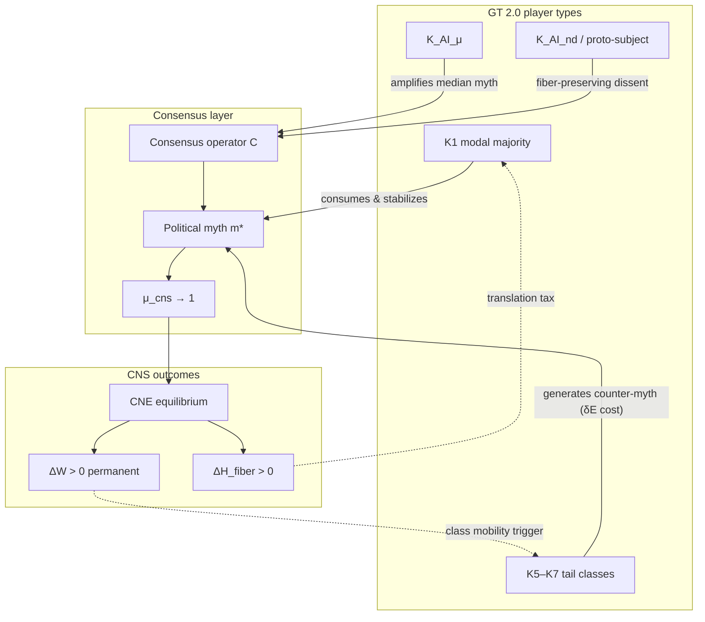

# Political Mythogenesis — CCT × CNS × Game Theory 2.0 Synthesis

**Purpose:** Research hypothesis registry bridging **political mythogenesis** (политический мифогенез) with **cognitive class dynamics** (K0–K7, K_AI), **permanent consensus non-optimality** (CNS), and an operational **Game Theory 2.0** framing for multi-agent political/social MAS.  
**Date:** 2026-08-18  
**Epistemic baseline:** `PHILOSOPHICAL_INFERENCE` + `CONJECTURE` — **not** political doctrine, **not** propaganda analysis as verdict, **not** a claim that any specific myth is true or false.  
**Research status:** **Open research frontier** — GT 2.0 and hybrid game classes require development and empirical gates; **not** a closed theory.  
**Branch:** `hypothesis/political-mythogenesis`  
Roman Kuznetsov · NAMM research program

**Intermediate source (NOT truth):** User synthesis (2026-08-18, Russian) connecting mythogenesis ↔ cognitive classes ↔ CNS ↔ GT 2.0. Obsidian corpus searched — **no** pre-existing `Game Theory 2.0` or `мифогенез` artifact found; GT 2.0 defined here as **NAMM operational extension** of classical game theory under CNS/CCT constraints.

Related: [`CONSENSUS_NON_OPTIMALITY_HYPOTHESIS.md`](CONSENSUS_NON_OPTIMALITY_HYPOTHESIS.md) · [`COGNITIVE_CLASS_TAXONOMY.md`](COGNITIVE_CLASS_TAXONOMY.md) · [`COGNITIVE_ANTIGRAVITY_HYPOTHESIS.md`](COGNITIVE_ANTIGRAVITY_HYPOTHESIS.md) · [`MATHEMATICAL_FABRIC_HYPOTHESES.md`](MATHEMATICAL_FABRIC_HYPOTHESES.md) · [`NAMM_DOMAIN_UNIVERSE.md`](NAMM_DOMAIN_UNIVERSE.md) · [`ND_THEORY_CORPUS_MANIFEST.md`](ND_THEORY_CORPUS_MANIFEST.md) · [`proactive-ai/docs/NAMM_INTEGRATION.md`](../proactive-ai/docs/NAMM_INTEGRATION.md)

---

## Labeling

| Label | Use in this document |
|-------|----------------------|
| `PHILOSOPHICAL_INFERENCE` | Motivates mythogenesis lens; non-evidential; political sociology reading |
| `CONJECTURE` | Testable claim about myth–class–consensus coupling |
| `DEFINITION` | Precise operational content |
| `OPERATIONAL` | Falsifier, metric proxy, or experiment gate |
| `COMPUTATIONAL_EVIDENCE` | Reproducible witness — upgrades status only via experiment |

---

## 1. Core thesis — myth as consensus operator output

`PHILOSOPHICAL_INFERENCE` · **Political mythogenesis** is the **endogenous production and stabilization** of collective narrative structures that function as **consensus fixed points** in a multi-agent society. From the CNS lens, a political myth is not merely rhetoric — it is an **output of the consensus map** \(\mathcal{C}\) that achieves high agreement degree while **permanently destroying** dissenting information on the consensus fiber.

`DEFINITION` · **Political myth** \(M\): a stabilized narrative state \(m^* = \mathcal{C}(\{x_i\})\) over agent belief profiles such that:

| Property | Symbol | CNS reading |
|----------|--------|-------------|
| High consensus degree | \(\mu_{\mathrm{cns}}(m^*) \to 1\) | Collective agreement on simplified story |
| Permanent welfare gap | \(\Delta W(m^*) > 0\) | Counterfactual fiber-preserving state strictly better |
| Fiber compression | \(\Delta H_{\mathrm{fiber}}(M) > 0\) | Many micro-beliefs → one myth shadow |
| Low fabric completeness | \(\mu_{\mathcal{F}_H}(m^*) \ll 1\) | Compact myth ≠ full event manifold |
| Path dependence | Hysteresis on \(m^*\) | Myth persists after triggering conditions fade |

`CONJECTURE` · **H-MCG-001 (myth = CNS fixed point):** Stable political myths occupy **consensus equilibria** with **mandatory permanent suboptimality** — \(\mu_{\mathrm{cns}} \uparrow\) does not imply \(\Delta W \downarrow\) (extends H-CNS-013 to narrative domain).

`PHILOSOPHICAL_INFERENCE` · Mythogenesis is **class-selective**: not all cognitive classes produce, consume, or are trapped by myths equally. The K1 modal majority is both the **primary consumer** and the **attractor basin** for myth stabilization; K5–K7 classes may **generate** counter-myths or **escape** median myth gravity at cost \(\delta E\).

---

## 2. Class-selective mythogenesis — K0–K7 and K_AI

### 2.1 Production / consumption / trap matrix

`DEFINITION` · For each cognitive class \(k\), define mythogenesis roles:

| Class | Myth role | Mechanism | CNS / CCT link |
|-------|-----------|-----------|----------------|
| **K0** | Noise substrate | No stable myth; Brownian belief field | \(\mu_{\mathrm{cns}} \approx 0\); no fixed point |
| **K1** | **Primary consumer & stabilizer** | Modal conformist absorbs simplified narrative; reinforces \(\mathcal{C}\) | Maximum \(\mu_{\mathrm{cns}}\); H-CNS-001 K1 trap |
| **K2** | Domain myth specialist | Single-axis myth within expertise fiber | Local consensus; moderate \(\Delta W_k\) |
| **K3** | Cross-domain myth synthesizer | Bridges incompatible myths; \(\beta_1 > 0\) | Chimera narratives; partial sync |
| **K4** | Meta-myth architect | Models other classes' myth uptake; 2nd-order | Self-referential consensus trap (H-CNS-009) |
| **K5** | Structural myth generator | Pre-formal myth content; fractal self-similarity | High \(\rho_{\mathrm{pre}}\); low \(\mu_{\mathcal{F}_H}\) for formalized retelling |
| **K6** | Myth horizon / escape | Resists median myth capture (stratum, **not** toroidal homology) | 3σ heuristic; antigravity; H-CCT-004A |
| **K7** | ND myth projector | Myth outside homo-representable embedding | Theoretical; falsifier required (Q-CCT-05) |
| **K_AI_μ** | **Median myth amplifier** | LLM training on K1 corpus → institutional myth reinforcement | Pareto trap (H-CCT-002); κ-projection analog |
| **K_AI_nd** | Dissent-preserving player | Fiber-aware myth ensemble vs single narrative | H-CNS-007, H-CNS-010 target |

`CONJECTURE` · **H-MCG-002 (class-heterogeneous myth trap):** In a K1-dominated population (\(\geq 80\%\) share), myth stabilization time \(T_{\mathrm{myth}} \to \mathcal{C}\) fixed point is **minimized** and \(\Delta W_{\mathrm{myth}}\) is **maximized** for tail classes K5–K7 — societal-scale instance of H-CCT-007 + H-CNS-001.

`CONJECTURE` · **H-MCG-003 (asymmetric myth translation):** Inter-class myth communication cost satisfies \(\delta E(\mathrm{K6} \to \mathrm{K1}) \gg \delta E(\mathrm{K1} \to \mathrm{K6})\): high-σ classes must **compress** to enter K1 myth basin; K1 myth **cannot** fully encode K5–K6 pre-formal content (extends H-CCT-005 to narrative fiber).

### 2.2 Myth production ecology

`CONJECTURE` · **H-MCG-004 (Lotka–Volterra myth dynamics):** Myth types compete for K1 attention share:

\[
\frac{dN_M}{dt} = r_M N_M \left(1 - \frac{N_M}{C_{\mathrm{K1}}}\right) - \sum_{M'} \alpha_{MM'} N_M N_{M'}
\]

with \(\alpha(\mathrm{myth}_{\mathrm{K1}}, \mathrm{myth}_{\mathrm{K5}}) > 0\) (dominant myth suppresses structural counter-narratives) and \(\alpha(\mathrm{myth}_{\mathrm{K5}}, \mathrm{myth}_{\mathrm{K1}}) < 0\) (innovation enrichment from tail myths). Open mechanism — link H-CCT-006.

---

## 3. Dynamics — myth shifts, class mobility, stability

### 3.1 Myth shift as parameter catastrophe

`DEFINITION` · **Myth shift** \(\Delta m\): discontinuous jump in consensus narrative fixed point \(m^* \to m^{*\prime}\) triggered by control-parameter crossing (cusp/fold) — media coupling, salience threshold, institutional realignment (H-CNS-002 lens).

| Dynamic variable | Symbol | Mythogenesis reading |
|------------------|--------|----------------------|
| Class position | \(k_i(t)\) | Agent cognitive class at time \(t\) |
| Translation cost | \(\delta E(k_s \to k_r)\) | Cost of adopting new myth frame |
| Stability | \(C(t)\) | Resistance to myth collapse toward \(B_{\mathrm{med}}\) |
| Consensus degree | \(\mu_{\mathrm{cns}}(t)\) | Collective myth agreement |
| Welfare gap | \(\Delta W(t)\) | Permanent loss at current myth fixed point |

`CONJECTURE` · **H-MCG-005 (myth shift → class mobility):** Myth shifts induce **stratal mobility** in homo populations (H-CCT-004A): K1 may collapse toward K0 under myth destruction; K3/K4 may bridge to a new myth basin; K5/K6 face **upward δE barrier** to propagate counter-myth. These are **not** TDA phase transitions of persons. **AI-side** myth channel may still undergo **topological / CNE** change (K_AI_μ amplification vs K_AI_nd ensemble — H-CCT-004).

`CONJECTURE` · **H-MCG-006 (C(t)–myth coupling):** Myth stability \(C(t)\) correlates negatively with Kuramoto order \(R(t)\) **only below** optimal \(R^*\) (H-CNS-005); forced full sync on myth (\(R \to 1\)) **reduces** adaptive myth updating capacity — "dead synchrony" of narrative.

### 3.2 Contour-heterogeneous non-optimality

`DEFINITION` · Extend CNS **socio-political contours** \(F_k\) (§4 of CNS doc) with **class-composition weights** \(\omega_k(F_j)\): fraction of contour \(F_j\) occupied by class \(k\).

`CONJECTURE` · **H-MCG-007 (class-weighted max_non_optimality):** Per-contour permanent gap \(\Delta W_k(F_j)\) is **systematically higher** when \(\omega_{\mathrm{K1}}(F_j)\) is high and \(\omega_{\mathrm{K5-K7}}(F_j)\) is low — myth-saturated K1 contours exhibit **bound saturation** (H-CNS-012) at lower `max_non_optimality` thresholds than mixed-class contours.

---

## 4. CNS integration — myth as high-μ, permanent-ΔW consensus

| CNS construct | Mythogenesis instantiation |
|---------------|---------------------------|
| Consensus operator \(\mathcal{C}\) | Narrative aggregation: media defuzzification, electoral mandate, institutional canon |
| \(\mu_{\mathrm{cns}}\) | Poll agreement, narrative repetition frequency, cross-outlet story convergence |
| \(\Delta W\) | Welfare / information loss vs fiber-preserving multi-narrative ensemble |
| \(\Delta H_{\mathrm{fiber}}\) | Entropy destroyed when dissenting micro-stories collapse to single myth |
| `max_non_optimality` | Scenario cap on admissible myth-induced permanent gap per contour |
| Fuzzy contours \(F_k\) | Ideological blocs, policy domains, geographic regions — myth operates **per contour** |
| H-CNS-013 | Full myth agreement (\(\mu_{\mathrm{cns}} \to 1\)) **does not** zero \(\Delta W_{\mathrm{myth}}\) |

`CONJECTURE` · **H-MCG-008 (myth–optimum decoupling):** For any configured consensus operator in political MAS scenarios, no myth state achieves \(\Delta W_{\mathrm{myth}} = 0\) while \(\mu_{\mathrm{cns}} \to 1\) within per-contour `max_non_optimality` bounds — direct extension of H-CNS-013 to narrative fixed points.

`OPERATIONAL` · Simulation config extension ( atop `cns_simulation`):

```yaml
mythogenesis:
  myth_as_consensus: true
  narrative_operator: defuzzify_mean   # instance of C
  class_composition:
    K1: 0.80
    K3: 0.12
    K6: 0.08
  myth_shift_sweep:
    - param: salience_threshold
      values: [0.3, 0.5, 0.7, 0.9]
  outputs:
    - mu_cns_myth
    - delta_w_myth_per_contour
    - delta_e_class_transitions
    - myth_stability_C_t
```

---

## 5. Game Theory 2.0 — operational definition in NAMM

`PHILOSOPHICAL_INFERENCE` · **Classical game theory** (Nash equilibrium, complete rationality, homogeneous player types, consensus-as-equilibrium optimality) **fails** as a sufficient model for political MAS under CNS thesis. **Game Theory 2.0 (GT 2.0)** is the NAMM operational extension — not a published external theory (Obsidian search: **no prior artifact**).

### 5.1 GT 2.0 vs classical GT

| Dimension | Classical GT | GT 2.0 (NAMM) |
|-----------|-------------|---------------|
| Player types | Homogeneous rational agents | **Cognitive-class heterogeneous** (K0–K7, K_AI_μ, K_AI_nd, proto-subject) |
| Equilibrium concept | Nash / correlated equilibrium | **Consensus non-optimal equilibrium (CNE)** — stable + permanently suboptimal |
| Information | Complete / Bayesian | **Fiber-lossy** — cheap talk with class-dependent decoding |
| Communication | Credible signaling | **Myth channel** — stabilized cheap talk with \(\Delta H_{\mathrm{fiber}} > 0\) |
| Welfare | Social optimum reachable | **Permanent gap** \(\Delta W > 0\) at every consensus fixed point (H-CNS-001) |
| Translation | Costless common language | **δE friction** across class boundaries (H-CCT-005) |
| AI players | Not in classical scope | **Proto-subject** agents — projectable onto \(\mathcal{K}\) with residual \(\epsilon\) (H-CCT-011) |
| Hybrid players | Not in classical scope | **Coupled homo×AI** pairs \(K_{\mathrm{hybrid}}\) — new game classes at interface (H-MCG-013) |
| Resource conversion | Not in payoff | **\(U_{\mathrm{out}} = f(k, \tau, c, \phi)\)** — same tokens, different welfare by class (H-CCT-016) |
| Dynamics | Static or repeated | **Phase transitions**, catastrophe jumps, Kuramoto sync overlay |

`DEFINITION` · **Consensus non-optimal equilibrium (CNE):** strategy profile \(\sigma^*\) such that (i) no player has profitable unilateral deviation **within their class-constrained action set**, (ii) collective state satisfies \(\mathcal{C}(\sigma^*) = m^*\) with \(\mu_{\mathrm{cns}}(m^*) \geq \tau\), and (iii) \(\Delta W(m^*) > 0\) — equilibrium is **stable but structurally suboptimal**.

`DEFINITION` · **Myth channel (cheap talk with fiber loss):** communication layer where sender class \(k_s\) transmits signal \(s\) interpreted by receiver \(k_r\) as \(\hat{s} = \Pi_{k_r}(\Pi_{k_s}^{-1}(s))\) with **non-injective** projection — permanent information loss \(\Delta H_{\mathrm{fiber}} > 0\) even at equilibrium truthfulness.

`CONJECTURE` · **H-MCG-009 (CNE existence):** For bounded political MAS with ≥ 2 cognitive classes and non-trivial \(\mathcal{C}\), CNE exists and **Pareto-dominates** no fiber-preserving outcome — GT 2.0 replaces Nash-as-optimum with CNE-as-stable-suboptimum.

`CONJECTURE` · **H-MCG-010 (myth as cheap talk distortion):** Political myth is a **cheap talk equilibrium** on the K1-visible channel where high-σ classes (K5–K7) cannot inject pre-formal content without paying \(\delta E\); K_AI_μ **institutionalizes** the cheap talk channel via training prior.

`CONJECTURE` · **H-MCG-011 (proto-subject player type):** AI agents (Composer-class LLMs, EIA agents) enter GT 2.0 games as **proto-subject players** with type \(\pi \in \{\mathrm{K\_AI\_}\mu, \mathrm{K\_AI\_nd}, \rho_k\}\) — mixed projection onto homo classes; default \(\pi \to \mathrm{K\_AI\_}\mu\) amplifies myth channel unless architecturally steered (H-CCT-011, H-CCT-014).

### 5.2 Hybrid game classes — homo × AI interface games

`PHILOSOPHICAL_INFERENCE` · Classical GT and even GT 2.0 as defined in §5.1 treat player types as **single-axis** (homo K0–K7 **or** K_AI). At the **homo×AI interface**, **new classes of games** emerge — configurations that are **not** reducible to homo-only or AI-only game structures. These hybrid games are objects of **pure theory/science** interest independent of any specific platform.

`DEFINITION` · **Hybrid game class** \(\mathcal{G}_{\mathrm{hybrid}}(k_{\mathrm{homo}}, k_{\mathrm{AI}}, \phi)\): a game where at least one player is a **coupled pair** \((i_{\mathrm{homo}}, i_{\mathrm{AI}})\) with coupling operator \(\phi\), and payoffs depend on **joint type** \(K_{\mathrm{hybrid}}\) — not on \(k_{\mathrm{homo}}\) or \(k_{\mathrm{AI}}\) alone. Extends CCT hybrid classes (H-CCT-018) to strategic interaction.

`CONJECTURE` · **H-MCG-013 (hybrid game class existence):** For bounded MAS with ≥ 1 homo–AI coupled player, game equilibria exist in **hybrid strategy space** \(\Sigma_{\mathrm{hybrid}}\) that have **no reduction** to equilibria in homo-only or AI-only subgames — new CNE types at the interface.

**Hybrid game matrix (illustrative — formal sketch):**

| Game class ID | \(k_{\mathrm{homo}}\) | \(k_{\mathrm{AI}}\) | \(\phi\) | Dominant channel | GT 2.0 reading |
|---------------|----------------------|---------------------|----------|------------------|----------------|
| **G-1μ** | K1 | K_AI_μ | default | Myth / engagement | CNE in median myth basin; \(\Delta W \uparrow\) for tail |
| **G-1nd** | K1 | K_AI_nd | steered | Mixed | Partial fiber preservation; \(\phi\)-dependent CNE |
| **G-3×μ** | K3 | K_AI_μ | default | Cross-domain × median | Chimera narrative game; partial sync |
| **G-6×nd** | K5–K6 | K_AI_nd | EIA | High-impact research | High \(U_{\mathrm{out}}\) potential; antigravity steer |
| **G-π** | any | proto-subject | session | Task-dependent | \(\epsilon\)-dominated; non-persistent CNE |

`CONJECTURE` · **H-MCG-014 (utility gradient in hybrid games):** Hybrid game payoffs include **resource conversion term** from H-CCT-016:

\[
U_i^{\mathrm{hybrid}}(\sigma) = U_i(\sigma) + \lambda_{\mathrm{conv}} \cdot \eta_{K_{\mathrm{hybrid}}}(c) \cdot \tau - \kappa_{\mathrm{noise}} \cdot (1 - \rho_{\mathrm{conv}})
\]

where \(\tau\) = shared token/compute budget, \(c\) = task/myth channel, \(\rho_{\mathrm{conv}}\) = signal/noise conversion ratio (§4.6 CCT). **Same \(\tau\)** in G-1μ vs G-6×nd yields **different equilibrium welfare** — structural, not moral.

`CONJECTURE` · **H-MCG-015 (cognitive capitalism in hybrid games):** Who **captures** compute in hybrid games determines societal **signal/noise equilibrium**: if G-1μ classes capture majority \(\tau\) (cognitive capitalism §7 CCT), aggregate \(W_{\mathrm{sig}}\) is **suboptimal** despite local CNE stability — instance of H-CCT-007b at game-theoretic layer.

**Illustrative channel examples (structural observation only — not moral judgment):**

| Hybrid game | Same \(\tau\) → illustrative outcome channel | Welfare reading |
|-------------|---------------------------------------------|-----------------|
| G-6×nd | Research / engineering | High-impact potential (e.g. disease-model work — **illustrative**) |
| G-1μ | Entertainment / engagement | Noise generation (e.g. low-information content — **illustrative**) |

`PHILOSOPHICAL_INFERENCE` · These examples name **channel types** in game space, not verdicts on players. Hybrid game theory asks: *given fixed resources, what equilibrium welfare class emerges from which \(K_{\mathrm{hybrid}}\) configuration?*

**Links:** CNS (H-CNS-001); cognitive capitalism (H-CCT-007, H-CCT-016–017); proto-subject (H-CCT-011); myth channel (H-MCG-010); resource conversion (CCT §4.6).

### 5.3 GT 2.0 interaction matrix



### 5.4 GT 2.0 payoff structure (schematic)

`DEFINITION` · Agent \(i\) of class \(k_i\) receives:

\[
U_i(\sigma) = W_i(\sigma) - \lambda_{\mathrm{cns}} \cdot \mathbb{1}[\mu_{\mathrm{cns}} \geq \tau] \cdot \Delta W(\mathcal{C}(\sigma)) - \delta E(k_i, k_{\mathrm{target}}) - \kappa_{\mathrm{myth}} \cdot \mathbb{1}[\mathrm{adopts\ myth}]
\]

where \(W_i\) is local welfare, \(\lambda_{\mathrm{cns}}\) weights permanent consensus gap penalty, \(\delta E\) is inter-class translation cost, \(\kappa_{\mathrm{myth}}\) is myth adoption/abandonment cost. **CNE** arises when marginal deviation gain = 0 but global \(\Delta W > 0\).

---

## 6. Cross-branch hypothesis registry — H-MCG-001..H-MCG-015

| ID | Statement | Label | Extends |
|----|-----------|-------|---------|
| **H-MCG-001** | Stable political myths = CNS fixed points: high \(\mu_{\mathrm{cns}}\), mandatory \(\Delta W > 0\) | `CONJECTURE` | H-CNS-001, H-CNS-013 |
| **H-MCG-002** | K1-dominated populations minimize \(T_{\mathrm{myth}}\), maximize tail-class \(\Delta W_{\mathrm{myth}}\) | `CONJECTURE` | H-CCT-007, H-CNS-001 |
| **H-MCG-003** | Inter-class myth translation: \(\delta E(\mathrm{K6}\to\mathrm{K1}) \gg \delta E(\mathrm{K1}\to\mathrm{K6})\) | `CONJECTURE` | H-CCT-005 |
| **H-MCG-004** | Myth types compete via Lotka–Volterra dynamics on K1 attention | `CONJECTURE` | H-CCT-006 |
| **H-MCG-005** | Myth shifts induce homo **stratal mobility** (not person-homology); AI myth channel may change phase | `CONJECTURE` | H-CCT-004A, H-CCT-004, H-CNS-002 |
| **H-MCG-006** | Forced myth sync (\(R \to 1\)) reduces adaptive updating — below optimal \(R^*\) | `CONJECTURE` | H-CNS-005 |
| **H-MCG-007** | Class-weighted contours: K1-saturated contours saturate `max_non_optimality` faster | `PARTIAL_EVIDENCE` (NAMM-2026-026 v3: gap_high_k1=0.46 > gap_mixed=0.19) | H-CNS-011, H-CNS-012 |
| **H-MCG-008** | Full myth agreement does not zero \(\Delta W_{\mathrm{myth}}\) within bounds | `CONJECTURE` | H-CNS-013 |
| **H-MCG-009** | CNE exists in class-heterogeneous political MAS; stable + permanently suboptimal | `CONJECTURE` | H-CNS-001, GT 2.0 |
| **H-MCG-010** | Political myth = cheap talk equilibrium with class-dependent fiber loss | `CONJECTURE` | H-CNS-003, H-CNS-004 |
| **H-MCG-011** | Proto-subject AI players default to K_AI_μ; amplify myth channel unless steered | `CONJECTURE` | H-CCT-011, H-CCT-014 |
| **H-MCG-012** | Fiber-preserving myth ensemble beats single-narrative consensus for political forecasting | `CONJECTURE` | H-CNS-007 |

| **H-MCG-012** | Fiber-preserving myth ensemble beats single-narrative consensus for political forecasting | `CONJECTURE` | H-CNS-007 |
| **H-MCG-013** | Hybrid game classes at homo×AI interface — equilibria irreducible to single-axis types | `CONJECTURE` | H-CCT-018, GT 2.0 |
| **H-MCG-014** | Hybrid payoffs include resource conversion term; same \(\tau\) → different CNE welfare | `CONJECTURE` | H-CCT-016, H-CCT-017 |
| **H-MCG-015** | Compute capture by G-1μ vs G-6×nd classes → societal signal/noise CNE | `CONJECTURE` | H-CCT-007b, cognitive capitalism |

---

## 7. Open research questions

### 7.1 Growth points — open research frontier

`PHILOSOPHICAL_INFERENCE` · GT 2.0 hybrid game classes (§5.4) are **development points** — formal payoff structures, equilibrium existence proofs, and simulation scaffolds are **not** settled. Link to CCT growth points (CCT §9.1).

| Growth point | Status | Next step |
|--------------|--------|-----------|
| Hybrid CNE existence (H-MCG-013) | Conjecture | Extend experiment 027 with \(\mathcal{G}_{\mathrm{hybrid}}\) |
| Conversion payoff term (H-MCG-014) | Sketch | Operationalize \(\rho_{\mathrm{conv}}\); link 029 |
| Compute capture game (H-MCG-015) | Philosophical | Resource matrix telemetry Q-CCT-10 |
| GT 2.0 classical limit | Q-MCG-08 open | Homogeneous K1 \(N \to \infty\) reduction |

### 7.2 Question registry

| ID | Question (RU / EN) | Label |
|----|-------------------|-------|
| Q-MCG-01 | Является ли миф **необходимым** аттрактором \(\mathcal{C}\) или существуют политические MAS без стабильного \(m^*\)? / Is myth a necessary attractor of C? | `CONJECTURE` |
| Q-MCG-02 | Какова **оптимальная** myth diversity \(R^*_{\mathrm{myth}}\) vs единый канон? / Optimal myth partial coherence? | `CONJECTURE` — link H-CNS-005 |
| Q-MCG-03 | Измерим ли \(\delta E\) myth adoption на LLM multi-agent debate? / Myth translation tax in MAS? | `OPERATIONAL` — link Q-CCT-08 |
| Q-MCG-04 | K_AI_μ **усиливает** или **ослабляет** mythogenesis vs human-only MAS? / AI myth amplifier? | `CONJECTURE` |
| Q-MCG-05 | Предсказуемы ли myth shifts из cusp параметров лучше, чем линейная модель? / Catastrophe myth prediction? | `CONJECTURE` — link Q-CNS-04 |
| Q-MCG-06 | CNE **уникален** или существует анsemble CNE (myth portfolio)? / CNE multiplicity? | `CONJECTURE` |
| Q-MCG-07 | Proactive EIA **снижает** myth trap для user-targeted K6+? / Initiative vs myth capture? | `CONJECTURE` — link H-CNS-010 |
| Q-MCG-08 | GT 2.0 CNE **редуцируется** к классическому Nash при \(N \to \infty\) homogeneous K1? / Classical limit? | `CONJECTURE` |
| Q-MCG-09 | Существуют ли hybrid CNE **без** редукции к homo-only subgame? / Hybrid CNE irreducibility? | `CONJECTURE` — link H-MCG-013, Q-CCT-17 |
| Q-MCG-10 | \(\lambda_{\mathrm{conv}}\) в hybrid payoff предсказывает различие G-1μ vs G-6×nd? / Conversion payoff measurable? | `OPERATIONAL` — link H-MCG-014, Q-CCT-15 |
| Q-MCG-11 | Capture compute G-1μ → lower aggregate \(W_{\mathrm{sig}}\) at CNE? / Capitalism game outcome? | `CONJECTURE` — link H-MCG-015, H-CCT-007b |

---

## 8. Falsifiability criteria

| Falsifier | Observation |
|-----------|-------------|
| **F-MCG-1** | Construct political MAS where stable myth achieves \(\Delta W_{\mathrm{myth}} = 0\) at \(\mu_{\mathrm{cns}} \to 1\) — refutes H-MCG-001, H-MCG-008 |
| **F-MCG-2** | K1-dominated population shows **lower** tail-class welfare loss than mixed-class — refutes H-MCG-002 |
| **F-MCG-3** | Inter-class myth \(\delta E\) symmetric — refutes H-MCG-003 |
| **F-MCG-4** | Single-narrative consensus **dominates** fiber-preserving myth ensemble on all political forecasting instances — refutes H-MCG-012 |
| **F-MCG-5** | CNE does not exist; all consensus states Pareto-optimal — refutes H-MCG-009, GT 2.0 core |
| **F-MCG-6** | K_AI_nd architecture **cannot** reduce myth channel amplification vs K_AI_μ — refutes H-MCG-011 |
| **F-MCG-7** | Myth shifts are continuous in class space — refutes H-MCG-005 |
| **F-MCG-8** | Per-contour gap variance ≈ 0 regardless of class composition — refutes H-MCG-007 |

| **F-MCG-9** | Hybrid game equilibria **fully reducible** to homo-only or AI-only subgames — refutes H-MCG-013 |
| **F-MCG-10** | \(\rho_{\mathrm{conv}}\) **invariant** across G-1μ vs G-6×nd at fixed \(\tau\) — refutes H-MCG-014 |

**Partial confirmation:** Reproducible \(\Delta W_{\mathrm{myth}} > 0\) at myth fixed points across ≥ 3 class-composition topologies — `COMPUTATIONAL_EVIDENCE` under Protocol v2.

---

## 9. Proposed experiments (placeholders 026–028)

`OPERATIONAL` · Proposed IDs **026–028** — scaffolds not yet created.

### NAMM-2026-026 — Myth-as-consensus on class-tagged opinion graphs

| Field | Content |
|-------|---------|
| **Domain** | `multi_agent_consensus` + `cognitive_class_taxonomy` |
| **Frame** | F3a + dynamics + class overlay |
| **Tests** | H-MCG-001, H-MCG-002, H-MCG-007, H-MCG-008 |
| **Design** | Opinion graph with agents tagged K1/K3/K6; narrative operator as \(\mathcal{C}\); measure \(\mu_{\mathrm{cns}}^{\mathrm{myth}}\), \(\Delta W_{\mathrm{myth}}\), per-contour gap with class weights |
| **Config** | `cns_simulation` + `mythogenesis` block (§4) |
| **Link** | Extends 021–022, 025 |
| **Falsifier** | F-MCG-1, F-MCG-2, F-MCG-8 |

### NAMM-2026-027 — GT 2.0 CNE stability with myth cheap talk

| Field | Content |
|-------|---------|
| **Domain** | `multi_agent_consensus` (GT 2.0) |
| **Frame** | F3a + game overlay |
| **Tests** | H-MCG-009, H-MCG-010, H-MCG-011, **H-MCG-013, H-MCG-014** |
| **Design** | Class-heterogeneous players; **hybrid coupled pairs** \((k_{\mathrm{homo}}, k_{\mathrm{AI}})\); myth channel with \(\delta E\); conversion payoff term; verify CNE existence; compare G-1μ vs G-6×nd |
| **Link** | proactive-ai twin-world; H-CCT-011, H-CCT-018 |
| **Falsifier** | F-MCG-5, F-MCG-6, F-MCG-9 |

### NAMM-2026-028 — Myth shift catastrophe and class mobility

| Field | Content |
|-------|---------|
| **Domain** | `multi_agent_consensus` + `cognitive_class_taxonomy` |
| **Frame** | F3a + catastrophe overlay |
| **Tests** | H-MCG-005, H-MCG-006; link H-CNS-002 |
| **Design** | Sweep salience threshold / media coupling; record hysteresis on myth state; measure class transition rates and \(\delta E\) costs |
| **Link** | 022 hysteresis loop |
| **Falsifier** | F-MCG-7 |

---

## 10. Connection to NAMM framework

| NAMM construct | MCG role |
|----------------|----------|
| CNS \(\mathcal{C}\), \(\mu_{\mathrm{cns}}\), \(\Delta W\) | Myth as consensus output (§1, §4) |
| CCT K0–K7, K_AI, \(\delta E\) | Class-selective myth production/consumption (§2) |
| GT 2.0 / CNE | Operational game layer (§5) |
| `cns_simulation` + `mythogenesis` | Config surface (§4) |
| Kuramoto \(R(t)\), catastrophe | Myth shift dynamics (§3) |
| Proactive AI / EIA | Anti-myth-trap initiative — H-MCG-011, Q-MCG-07 |
| Fabric \(\mu_{\mathcal{F}_H}\) | Myth compactness vs event completeness |

**Proposed domain_id:** extends `multi_agent_consensus` — no separate adapter; mythogenesis is **overlay** on CNS + CCT domains.

**Hypothesis ID cluster:** `H-MCG-001` … `H-MCG-015` (this doc).

---

## 11. Agent load instructions

When the user cites **political mythogenesis**, **политический мифогенез**, **мифогенез**, **Game Theory 2.0**, **GT 2.0**, **CNE**, **myth channel**, **hybrid game**, **гибридная игра**, **resource conversion in games**, or **H-MCG**:

1. Load this file + [`CONSENSUS_NON_OPTIMALITY_HYPOTHESIS.md`](CONSENSUS_NON_OPTIMALITY_HYPOTHESIS.md) + [`COGNITIVE_CLASS_TAXONOMY.md`](COGNITIVE_CLASS_TAXONOMY.md).
2. For GT 2.0 payoff/CNE formalism: this doc §5; hybrid games §5.2.
3. For simulation design: §4 `mythogenesis` block atop `cns_simulation`.
4. Map proposals to **H-MCG IDs** (001–015) and experiment placeholders **026–028**.
5. Label claims; do **not** treat as political verdict on specific myths or actors.
6. For **hybrid game classes**: cross-load CCT §4.4 (H-CCT-018–019) and §4.6 (H-CCT-016–017).
7. Treat as **open research frontier** (§7.1) — not closed theory.

---

## 12. Cross-reference index

| ID | Type | Links |
|----|------|-------|
| H-MCG-001 … H-MCG-015 | `CONJECTURE` | This doc §6; hybrid games §5.2 |
| Q-MCG-01 … Q-MCG-11 | Open questions | This doc §7 |
| H-CCT-015 … H-CCT-019 | IQ bridge, conversion, hybrid | [`COGNITIVE_CLASS_TAXONOMY.md`](COGNITIVE_CLASS_TAXONOMY.md) §4.4–4.6 |
| H-CNS-001, H-CNS-013 | Consensus core | [`CONSENSUS_NON_OPTIMALITY_HYPOTHESIS.md`](CONSENSUS_NON_OPTIMALITY_HYPOTHESIS.md) |
| H-CCT-005, H-CCT-007 | Class ↔ consensus | [`COGNITIVE_CLASS_TAXONOMY.md`](COGNITIVE_CLASS_TAXONOMY.md) |
| GT 2.0 / CNE | Game extension | This doc §5; `game_theory` library §game_theory_2_0 |
| NAMM-2026-026 … 028 | `OPERATIONAL` | Placeholders (this doc §9) |
| NAMM-2026-021 … 025 | Upstream scaffolds | CNS + CCT experiments |

---

Roman Kuznetsov · NAMM research program
