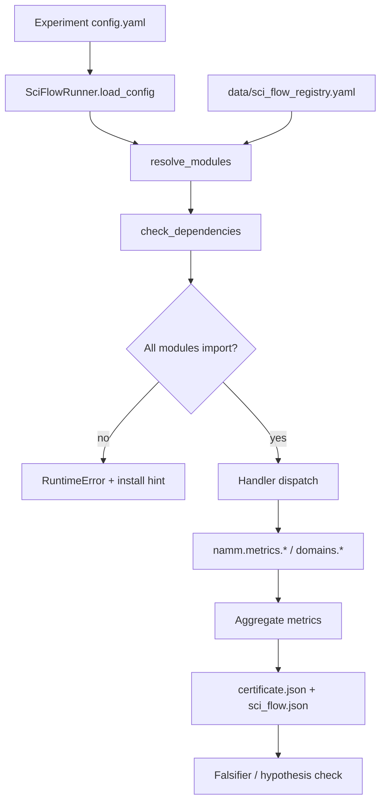

# NAMM Sci Flow

Roman Kuznetsov · NAMM research program

Related: [`SCIENTIFIC_STACK.md`](SCIENTIFIC_STACK.md) · [`NAMM_DOMAIN_UNIVERSE.md`](NAMM_DOMAIN_UNIVERSE.md) · [`data/sci_flow_registry.yaml`](../data/sci_flow_registry.yaml) · [`data/mathematics_library_base.yaml`](../data/mathematics_library_base.yaml)

---

## Purpose

**Sci Flow** is NAMM's declarative pipeline for routing hypotheses and experiments to the correct scientific modules (`entropy`, `fuzzy`, `catastrophe`, `consensus`, `cognitive_class`, `kuramoto`, `game_theory_2_0`, `tda`, …).

It replaces ad-hoc import chains in individual `run_experiment.py` scripts with:

1. **Registry-driven routing** — experiment ID or hypothesis ID → required modules
2. **Dependency checking** — optional `[science]` / `[nd]` extras validated before run
3. **Unified certificate** — hypothesis support, falsifiers, and metrics in one artifact
4. **CLI entry point** — `namm sci-flow run --experiment NAMM-2026-021`

---

## Architecture



### Pipeline stages

| Stage | Module | Description |
|-------|--------|-------------|
| `load_config` | `runner.py` | Read `experiments/<id>/config.yaml` |
| `select_modules` | `registry.py` | Resolve from `sci_modules`, experiment route, or hypothesis route |
| `check_dependencies` | `adapters.py` | Import each module; report missing `[science]` / `[nd]` extras |
| `run_modules` | `handlers.py` | Execute experiment-specific handler (calls metric batch functions) |
| `aggregate` | `runner.py` | Merge metrics + hypothesis support |
| `certificate_check` | `runner.py` | Emit `certificate.json` with status PARTIAL_EVIDENCE / INCONCLUSIVE / FALSIFIER_TRIGGERED |

### Package layout

```
src/namm/sci_flow/
  __init__.py      # public API
  registry.py      # YAML loader + module resolution
  adapters.py      # import checks + module catalog
  handlers.py      # experiment runners (021–030)
  runner.py        # SciFlowRunner orchestration

data/sci_flow_registry.yaml   # declarative routes
```

---

## Module map

| Module ID | Python import | Branch | Optional extra |
|-----------|---------------|--------|----------------|
| `entropy` | `namm.metrics.entropy` | CNS, CCT | — |
| `fuzzy` | `namm.metrics.fuzzy` | CNS, MCG | — |
| `catastrophe` | `namm.metrics.catastrophe` | CNS, MCG | — |
| `consensus` | `namm.metrics.consensus_non_optimality` | CNS | — |
| `kuramoto` | `namm.metrics.consensus_non_optimality` | CNS | — (requires `consensus`) |
| `cognitive_class` | `namm.metrics.cognitive_class` | CCT, MCG | — |
| `game_theory_2_0` | `namm.metrics.cognitive_class` | MCG | — |
| `tda` | `namm.domains.tda.homology` | CCT | `[nd]` |
| `antigravity` | `namm.metrics.antigravity_embedding` | CCT | — |

Research branches:

| Branch | Label | Default modules |
|--------|-------|-----------------|
| `CNS` | Consensus Non-Optimality | entropy, fuzzy, consensus |
| `CCT` | Cognitive Class Taxonomy | cognitive_class, entropy |
| `MCG` | Political Mythogenesis + GT 2.0 | consensus, cognitive_class, catastrophe, fuzzy |

---

## Declaring modules in experiments

Add an optional `sci_modules` list to `config.yaml`. If omitted, modules are inferred from `data/sci_flow_registry.yaml` via `experiment_id` and `hypothesis_id`.

```yaml
experiment_id: NAMM-2026-021
hypothesis_id: H-CNS-011
sci_modules:
  - entropy
  - fuzzy
  - consensus
  - kuramoto
```

Explicit `sci_modules` are **merged** with registry routes (deduplicated).

---

## Example configs

### NAMM-2026-021 (CNS welfare fiber)

```yaml
experiment_id: NAMM-2026-021
hypothesis_id: H-CNS-011
sci_modules: [entropy, fuzzy, consensus, kuramoto]
cns_simulation:
  consensus_operator: defuzzify_mean
  num_agents: 48
  fuzzy_contours: [...]
```

**Resolved modules:** entropy, fuzzy, consensus, kuramoto  
**Handler:** `run_021` → `run_cns_batch`

### NAMM-2026-026 (MCG myth-as-consensus)

```yaml
experiment_id: NAMM-2026-026
hypothesis_id: H-MCG-001
sci_modules: [consensus, cognitive_class, fuzzy]
class_compositions:
  - {K1: 0.85, K3: 0.10, K6: 0.05}
mythogenesis:
  signal: [1.0, 0.25, 0.08]
```

**Resolved modules:** consensus, cognitive_class, fuzzy  
**Handler:** `run_026` → `run_myth_consensus_batch`

### NAMM-2026-028 (MCG myth shift catastrophe)

```yaml
experiment_id: NAMM-2026-028
hypothesis_id: H-MCG-005
sci_modules: [catastrophe, cognitive_class, consensus]
coupling_values: [0.5, 1.0, 1.5, 2.0, 2.5, 3.0, 3.5]
salience_values: [0.2, 0.4, 0.6, 0.8, 1.0]
```

**Resolved modules:** catastrophe, cognitive_class, consensus  
**Handler:** `run_028` → `run_myth_shift_sweep`

---

## CLI usage

```bash
# Run experiment through sci-flow pipeline
namm sci-flow run --experiment NAMM-2026-021

# Dry-run: show which modules would load
namm sci-flow describe --experiment NAMM-2026-028

# List all registered modules
namm sci-flow catalog
```

### Python API

```python
from namm.sci_flow import run_sci_flow, resolve_modules

modules = resolve_modules(experiment_id="NAMM-2026-021")
result = run_sci_flow("NAMM-2026-021")
print(result.certificate["status"])
print(result.modules_used)
```

---

## Artifacts

After a sci-flow run, `experiments/<id>/artifacts/` contains:

| File | Content |
|------|---------|
| `result.json` | Experiment summary (same as legacy runner) |
| `certificate.json` | Unified certificate with `sci_modules`, hypothesis support |
| `sci_flow.json` | Full pipeline metadata (stages, dependency check) |
| `batch_detail.json` / `*_sweep.json` | Domain-specific detail (handler-dependent) |

---

## Extension guide

### Add a new module

1. Implement metrics in `src/namm/metrics/<name>.py`
2. Add entry under `modules:` in `data/sci_flow_registry.yaml`
3. Optionally add `requires:` for dependency edges
4. Map hypotheses under `hypothesis_routes:` and experiments under `experiment_routes:`

### Add a new experiment handler

1. Implement `run_XXX(config, **kwargs) -> dict` in `handlers.py`
2. Register in `HANDLERS` dict and `experiment_routes` in YAML
3. Add `sci_modules` to experiment `config.yaml`
4. Add test in `tests/test_sci_flow.py`

### Optional PyPI dependencies

Set `namm_extra: science` or `namm_extra: nd` on the module entry. Sci Flow will suggest `pip install -e ".[science]"` when import fails.

---

## Cross-references

- Scientific stack install: [`SCIENTIFIC_STACK.md`](SCIENTIFIC_STACK.md)
- Math library mapping: `scientific_stack` + `sci_flow_registry` in [`mathematics_library_base.yaml`](../data/mathematics_library_base.yaml)
- Domain universe experiment table: [`NAMM_DOMAIN_UNIVERSE.md`](NAMM_DOMAIN_UNIVERSE.md) §4
