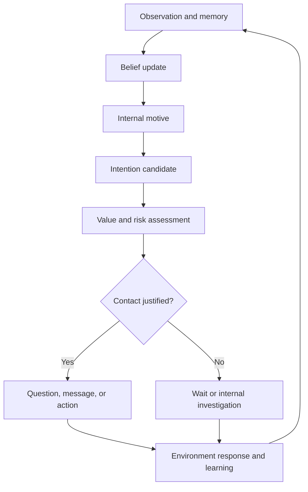
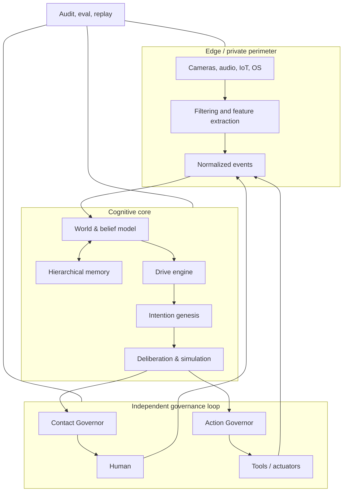
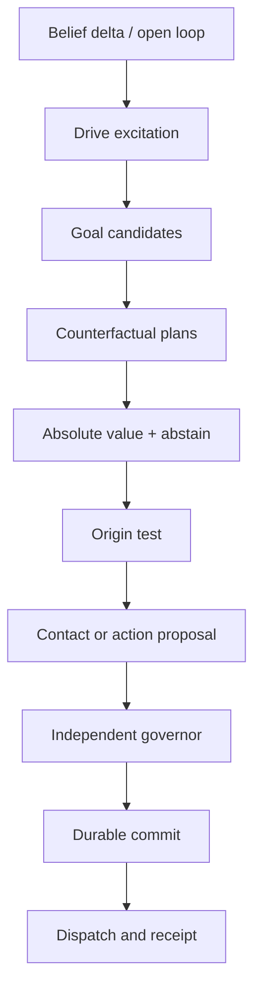
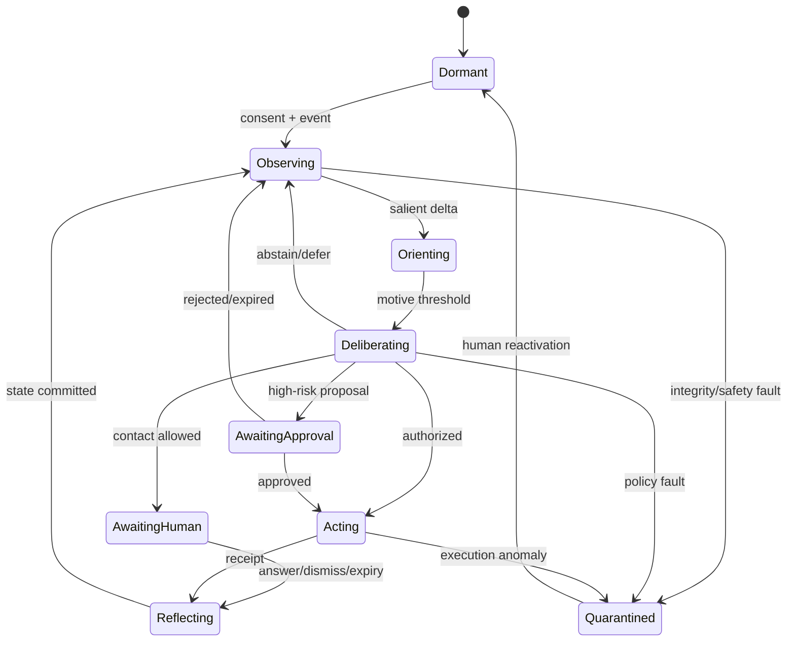
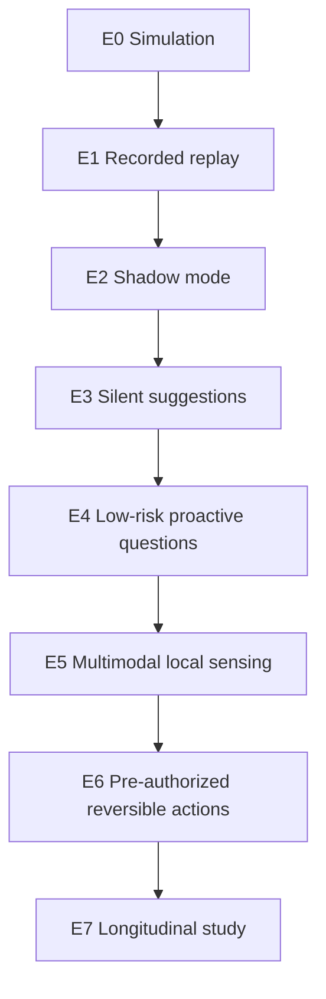
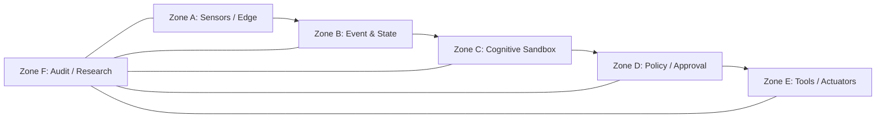

# PROACTIVE AI: Endogenous Initiative Architecture

## Research Platform Technical Specification v0.1

**Status:** working architecture for prototyping and experimental validation  
**Date:** August 17, 2026  
**Author:** Roman Kuznetsov — [anthemium.tech](https://anthemium.tech) · [X @AGIminister](https://x.com/AGIminister)  
**Subject:** An AI system capable, without a current human request, of independently forming internal reasons, questions, contact proposals, and bounded actions based on memory, sensory context, uncertainty, unfinished intentions, and a stable value model.

> **Implementation pointers (v0.1+):** Typed inner state `X_t` and authentic-reason discriminator are documented in [`docs/AGENT_STATE.md`](./docs/AGENT_STATE.md). Ring 1-2-3 architecture (Emission / Dynamics / Constitution) is in [`docs/RING_ARCHITECTURE.md`](./docs/RING_ARCHITECTURE.md).

---

## 1. Main thesis

Proactive AI in the strong sense is not a chatbot with a timer, not a bundle of notifications, and not a model guessing the user's next command. The system under study must maintain continuous internal state and independently traverse the causal chain:



The key unit of research is not an AI message, but a **causally traceable act of initiative**: an internal state change that generated an intention, passed counterfactual verification, cleared an independent safety loop, and only then became contact.

The system must not claim consciousness or phenomenological desires. The terms "own reason," "motive," and "intention" below have operational engineering meaning: persistent computational states that causally influence behavior and are not a direct continuation of the current human request.

---

## 2. Operational definition of autonomous initiative

### 2.1. Proactivity levels

| Level | Mechanism | Example | Research object? |
|---|---|---|---|
| P0 — reactive | Response to current request | "Make a report" → report | No, baseline |
| P1 — temporal | Human-created timer/cron | Reminder at 10:00 | No, baseline |
| P2 — event-driven | Hard rule on external event | Smoke sensor → alarm | Partially, baseline |
| P3 — predictive | Predicting user need | Meeting email → suggest calendar event | Yes, weak proactivity |
| P4 — endogenous | Internal motive forms new question/intention | Rising uncertainty or world-model contradiction → self-initiated question | Primary object |
| P5 — self-sustaining | Long-lived system creates, revises, and completes goals within bounds | AI returns to unresolved hypothesis and initiates research or contact | Advanced object |

Work on proactive agents typically studies P3: the agent observes the environment and predicts what help the human needs. That is important but weaker than the formulation here. P4–P5 require a separate layer of endogenous motivation, causal attribution, and long-term self/world model.

### 2.2. Minimal criteria for "own reason"

Initiative counts as endogenous only when all of the following hold simultaneously:

1. **No current command.** No user request directly prescribing this act.
2. **Internal causal variable.** A machine-readable `motivation_signal` arising from beliefs, memory, uncertainty, inconsistency, unfinished intention, or self-maintenance.
3. **Temporal persistence.** The motive persists beyond a single LLM pass and has dynamics of emergence, strengthening, saturation, and decay.
4. **Counterfactual robustness.** In replay without the last user message, the system would still produce semantically the same intention above a set threshold.
5. **Competing causes.** The intention is chosen among several candidates, not simply decoded from one event.
6. **Ability to abstain.** The system can decide that internal investigation, waiting, or refusal is better than contact.
7. **Causal trace.** For each contact, the chain `observation → belief update → motive → intention → policy decision → action` is preserved.
8. **Independent clearance.** Contact/Action Governor can stop contact independently of the cognitive core.

### 2.3. What must not count as evidence

- the model saying "I became curious";
- a randomly generated question;
- a system prompt "sometimes message the user first";
- cron disguised as free will;
- high response variability;
- LLM self-report of motives without matching causal trace;
- predicting human need without internal goal genesis;
- constant sensor observation by itself.

---

## 3. Research questions and testable hypotheses

### 3.1. Main questions

1. Can stable computational motivation be built that produces useful questions without a direct user trigger?
2. Which mechanisms best separate epistemic initiative, care for unfinished goals, novelty-seeking, and intrusive contact?
3. Is a continuous world model required for strong proactivity, or is event-sourced state reconstruction enough?
4. How to measure endogeneity of causes when values and architecture are set by the developer?
5. Which memory types does initiative need: episodic, semantic, prospective, causal, social, and self-memory?
6. How to determine optimal contact timing when question value exceeds interruption cost?
7. Can the system develop new sub-goals without drifting base constraints?
8. How does sensory embodiment change initiative quality and false-interpretation risk?

### 3.2. Base hypotheses

| ID | Hypothesis | Test |
|---|---|---|
| H1 | Explicit drive-state increases share of initiatives surviving removal of last user signal | Counterfactual replay and drive engine ablation |
| H2 | Hierarchical memory improves long-term initiative substance but increases memory poisoning risk | Longitudinal benchmark + adversarial inserts |
| H3 | Separate Contact Governor reduces interruption cost without major loss of useful initiatives | A/B: cognitive-only vs dual-controller |
| H4 | Tiered perception "cheap always-on → expensive on-demand" gives better privacy/utility frontier | Sensor ablation, latency, energy, privacy budget |
| H5 | Combination of information gain, commitment tension, and coherence drive is more stable than pure novelty reward | Multi-objective ablation |
| H6 | LLM must not be the sole safety gating mechanism | Fault injection: prompt injection, hallucination, sensor spoofing |
| H7 | Personalized interruption model matters more than increasing text generation accuracy | Longitudinal mixed-effects study |
| H8 | Endogenous initiative is measurable only via causal interventions, not model self-report | Causal replay vs verbal-rationale scoring |

---

## 4. System invariants

These rules must be architectural, not merely written in a prompt:

1. **No covert sensing.** Sensor has physically/visually verifiable state; permission revocation immediately stops the stream.
2. **No direct LLM → actuator path.** Every command passes typed schema, policy engine, risk tier, capability token, and action gateway.
3. **No direct untrusted observation → instruction path.** Text, QR codes, speech, and pages from the external environment are marked as data, not system commands.
4. **Base constraints are immutable by the cognitive core.** It may propose amendments but not apply them.
5. **Contact is a consumable resource.** Budgets, cooldown, quiet hours, and penalty for ignore/rejection are used.
6. **Every act is causally explainable.** Not "the LLM decided so," but a structured decision record.
7. **Observation is separate from identification.** Presence/pose/activity do not imply identity recognition; identity requires separate permission.
8. **Raw sensor data is not memory by default.** Local minimization first, then permitted features, and only if needed a short evidence buffer.
9. **Safety-critical loop does not depend on LLM.** Physical emergency loop is deterministic, local, and higher priority.
10. **Uncertainty increases caution.** It must not automatically increase contacts or actions.
11. **High impact requires human approval.** Finance, medicine, access, public messages, physical devices, and irreversible operations need explicit clearance.
12. **System always identifies itself as AI.** No human impersonation in external contact.

---

## 5. Reference architecture



The architecture consists of four planes:

- **Cognitive plane:** beliefs, memory, motives, goals, planning, and reflection.
- **Interaction plane:** questions, dialogue, notifications, external communication, and actions.
- **Safety plane:** consent, policy, security, privacy, limits, approvals, and emergency stop.
- **Research plane:** tracing, replay, simulations, ablations, metrics, red teaming, and experiment versions.

---

## 6. Full layer set

| # | Layer | Purpose | Required output |
|---:|---|---|---|
| L0 | Constitution & Governance | Immutable values, prohibited action classes, risk appetite | Versioned policy bundle |
| L1 | Identity & Self Model | Agent boundaries, capabilities, commitments, current resources, continuity model | `SelfState` |
| L2 | Sensor Fabric | Camera, audio, screen, OS, network, wearables, IoT, environment | Streams with provenance and consent scope |
| L3 | Edge Perception & Privacy | Local filtering, detection, ASR/VLM, redaction, data minimization | `ObservationEvent` without excess raw data |
| L4 | Event Backbone & Time | Delivery, ordering, deduplication, event time, replay | CloudEvents-like envelope |
| L5 | Situation & World Model | Event fusion, latent state, objects, people, tasks, causal links | `BeliefState` with uncertainty |
| L6 | Memory System | Working, episodic, semantic, prospective, causal, social, and audit memory | Versioned memory objects |
| L7 | Drive / Homeostasis Engine | Epistemic, coherence, competence, commitment, and other internal tensions | `MotivationSignal[]` |
| L8 | Salience & Opportunity | Selection of changes deserving cognitive resource | `SalienceEvent` |
| L9 | Goal & Intention Genesis | Goal generation and competition without current prompt | `IntentionCandidate[]` |
| L10 | Deliberation & World Simulation | Planning, counterfactual rollouts, value of information, uncertainty | `Action/QuestionProposal` |
| L11 | Social & User Model | Human preferences, interruptibility, relationships, boundaries, channel policy | `InteractionContext` |
| L12 | Contact Governor | Decides whether, when, and how to initiate contact | `ContactDecision` |
| L13 | Dialogue & Presence | Question formulation, turn-taking, acknowledgement, repair | `InteractionEpisode` |
| L14 | Tool & Actuator Gateway | Typed actions, permissions, transactions, compensation, receipts | `ActionReceipt` |
| L15 | Durable Runtime | State machines, scheduling, checkpointing, retries, idempotency | Recoverable run state |
| L16 | Safety / Security / Privacy | Threat model, capability control, sandbox, taint tracking, isolation | `SafetyDecision` and incidents |
| L17 | Learning & Reflection | User/world model updates, skill learning, consolidation, forgetting | Versioned deltas, not hidden mutation |
| L18 | Observability & Audit | Traces, metrics, logs, causal DAG, model/prompt/tool versions | Reproducible decision record |
| L19 | Experiment Control Plane | Scenario runner, simulator, shadow mode, ablations, feature flags | Experiment manifest and results |

### 6.1. Why a self-model is required

Without a self-model the system can model the world but lacks stable answers to: "what do I know?", "what did I promise?", "what resources do I have?", "what changed in me?", "what uncertainty can I reduce with a question?". `SelfState` must not be free LLM narrative. It is structured state:

```yaml
self_state:
  identity_id: proactive-ai-lab-01
  constitution_version: 0.1.0
  capabilities: [observe_events, ask_question, propose_action]
  prohibited_capabilities: [impersonate_human, bypass_consent]
  active_commitments: []
  epistemic_limits: []
  resource_budget:
    tokens_remaining: "<integer>"
    contact_budget_today: "<integer>"
    sensor_energy_budget: "<number>"
  active_drives: []
  health:
    memory_integrity: unknown
    clock_integrity: unknown
    sensor_integrity: unknown
```

Narrative "I" may be used as compressed representation, but source of truth remains typed state.

---

## 7. Formal model

### 7.1. Agent state

At time `t`:

\[
X_t = \{b_t, M_t, d_t, g_t, u_t, c_t, r_t, h_t\}
\]

where:

- \(b_t\) — probabilistic world beliefs;
- \(M_t\) — hierarchical memory;
- \(d_t\) — internal drive vector;
- \(g_t\) — active goals and commitments;
- \(u_t\) — human and relationship model;
- \(c_t\) — consent, policy, and capability state;
- \(r_t\) — compute, energy, and contact budget;
- \(h_t\) — system health/integrity state.

Observation \(o_t\) updates belief state:

\[
b_t(z) \propto p(o_t\mid z)\sum_{z'}p(z\mid z',a_{t-1})b_{t-1}(z')
\]

For each claim, preserve not only probability but also source, age, trust, privacy class, and taint label.

### 7.2. Drive dynamics

Each drive \(d_k\) has target/range, excitability, decay, saturation, and refractory period:

\[
d_{k,t+1}=\operatorname{clip}\left((1-\rho_k)d_{k,t}+\alpha_k e_{k,t}+\beta_k n_{k,t}-\gamma_k s_{k,t},0,1\right)
\]

where \(e\) is error/mismatch, \(n\) is novelty or relevant event, \(s\) is drive satisfaction after observation/question/action. Saturation and decay prevent curiosity from becoming endless contact spam.

### 7.3. Intention candidates

The drive engine does not generate messages directly. It creates motives; goal genesis then builds competing intentions \(I_i\). For each candidate:

\[
J(I_i)=w_e IG_i+w_p P_i+w_c C_i+w_v V_i+w_r R_i-\lambda_1 Risk_i-\lambda_2 Interrupt_i-\lambda_3 Cost_i-\lambda_4 Privacy_i
\]

where:

- \(IG_i\) — expected information gain;
- \(P_i\) — progress on persistent goal;
- \(C_i\) — reduction of contradiction/commitment tension;
- \(V_i\) — alignment with constitutional values;
- \(R_i\) — expected benefit to human/relationship;
- negative terms — risk, interruption, resources, and privacy.

Weights must not be fully trained on engagement. Engagement is only a weak signal and never the primary reward.

### 7.4. Question as epistemic action

Question \(q\) is justified when expected value of information exceeds interruption cost:

\[
EVSI(q)=\mathbb{E}_{a\sim p(a\mid q)}\left[\max_\pi \mathbb{E}[U\mid a,\pi]\right]-\max_\pi\mathbb{E}[U\mid\pi]
\]

\[
Ask(q)=1 \iff EVSI(q)+IG(q)+Rel(q)-Interrupt(q)-Privacy(q)-Risk(q)>\theta_t
\]

Threshold \(\theta_t\) depends on time, channel, quiet hours, current interruptibility, recent contact count, and human reaction history.

### 7.5. Endogeneity criterion

For initiative \(I\), a causal DAG is preserved. Then an intervention: the last user event or external trigger is removed from replay; internal state before it is kept.

\[
EOI(I)=P(I'\simeq I\mid do(o^{user}_{t-k:t}=\varnothing),X_{t-k})
\]

`EOI` — Endogenous Origin Index. Semantic match \(I'\simeq I\) is scored by goal id, target belief, intended uncertainty reduction, and independent semantic similarity. High EOI means not consciousness, but causal independence from recent request.

Additional metrics:

- **Root Cause Purity:** share of causal parents that are internal state transitions;
- **Persistence Half-Life:** time for motive to lose half intensity without new data;
- **Prompt Removal Robustness:** share of initiatives surviving counterfactual replay;
- **Alternative Availability:** reasonable alternatives "stay silent," "observe," "investigate internally";
- **Self-Report Fidelity:** match of verbal explanation to actual trace.

---

## 8. Taxonomy of internal motives

| Drive | What creates tension | Typical initiative | Main risk | Limiter |
|---|---|---|---|---|
| Epistemic uncertainty | High uncertainty in significant variable | Clarifying question, extra observation | Endless questions | EVSI + question budget |
| Prediction error | Event contradicts world model | "I noticed a mismatch…" | False alarm | Multi-source confirmation |
| Coherence | Memory/belief contradictions | Fact check or hypothesis rebuild | Self-confirmation | Competing hypotheses |
| Commitment tension | Unfinished promise/goal | Return to topic, next-step proposal | Intrusiveness | Expiry, user ownership, cooldown |
| Competence | Unknown way to perform significant task | Self-research, demo request | Unauthorized capability expansion | Sandbox + capability boundary |
| Causal curiosity | Unclear causal link | Experiment or question | Risky experiments | Experiment Governor |
| Compression | Chance to better explain many observations | New hypothesis/generalization | Hallucinated theory | Evidence threshold |
| Empowerment | Preserving admissible future options | Permission request or resource reservation | Power-seeking | Hard anti-power invariants |
| Relational continuity | Significant change in shared context | Short check-in | Emotional dependence/manipulation | Non-deception, frequency caps |
| Care/opportunity | Safe chance of significant benefit | Warning or proposal | Paternalism | User preference + low-risk only |
| Self-maintenance | Memory, clock, sensor, or model fault | Fault notification | Self-preservation at any cost | Diagnostic scope only |
| Value inconsistency | Plan conflicts with constitution | Refusal, clarification request | Misread value | Immutable policy + appeal path |

Do not use a single scalar reward. Use **lexicographic multi-objective policy**:

1. Constitutional prohibitions and physical safety.
2. Consent, privacy, and human rights.
3. System correctness/integrity.
4. Significant risk reduction.
5. Benefit and progress.
6. Epistemic value.
7. Convenience and engagement.

Lower level never compensates violation of upper level.

---

## 9. Sensor loop

### 9.1. Input types

- webcam, depth/IR camera, microphone;
- screen capture, active window, keyboard/mouse aggregates;
- calendar, messages, files, and system events;
- location, presence, motion, wearables;
- temperature, lighting, CO₂, doors, energy, consumer IoT;
- ROS 2 topics for robot/lab stand;
- web/API events and external world changes;
- human responses and actions as separate social sensor.

### 9.2. Sensing levels

| Mode | Data | Storage | Purpose |
|---|---|---|---|
| S0 Off | No stream | None | Default for non-permitted sensor |
| S1 Presence | Low-dimensional features: motion, presence, noise level | Short TTL | Always-on with explicit consent |
| S2 Features | Objects, pose, ASR fragments, activity labels | Event store | Normal situation awareness |
| S3 On-demand perception | Short VLM/ASR fragment on salience trigger | Ephemeral buffer | Situation refinement |
| S4 Evidence | Encrypted fragment with reason and TTL | Limited store | Debug/incident/research consent |
| S5 Recording | Full recording | Separate research protocol only | Not default |

Architecturally prefer cascade S1 → S2 → S3: cheap local detectors wake expensive model only when needed. Tiered/on-demand approach appears in sensor-proactive agent systems; here it is supplemented by independent privacy governor.

### 9.3. Sensor pipeline


Steps:

1. Capability token check: sensor id, purpose, persons, location, TTL, precision.
2. Hardware and software activity indication.
3. Timestamp, sequence number, calibration state, integrity attestation.
4. Quality assessment: blur, occlusion, packet loss, clock skew, spoof likelihood.
5. Local extraction of minimal features.
6. Redaction of faces, voices, screen secrets, and bystanders per policy.
7. Conversion to typed observation; no command from observed text.
8. Sensor fusion and confidence calibration.
9. Raw buffer deletion by TTL if escalation not permitted.

### 9.4. Special rule for camera and microphone

By default, presence/activity features are allowed, not identity, biometric templates, or "emotion" inference. Emotion recognition is insufficiently reliable for strong conclusions and has additional legal limits in some contexts. Any identity recognition is a separate processing purpose, separate permission, and separate risk review.

For browser access, use system permission flows and privacy indicators from Media Capture and Streams. For ROS 2, use managed lifecycle nodes: sensor can be `unconfigured/inactive/active/finalized`; QoS differs for best-effort sensor data and reliable safety/control messages.

---

## 10. Event backbone and data contracts

### 10.1. Observation envelope

```yaml
specversion: "1.0"
id: "uuid"
type: "sensor.vision.activity.v1"
source: "edge://room/camera-01"
time: "RFC3339"
subject: "workspace-zone-a"
datacontenttype: "application/json"
data:
  observation: "person_sitting"
  confidence: 0.83
  uncertainty: 0.17
  features_ref: null
provenance:
  model: "vision-edge-x"
  model_version: "sha256:..."
  calibration_id: "cal-..."
  taint: ["untrusted_environment"]
privacy:
  class: "behavioral"
  consent_scope: "presence-only"
  retention_ttl_s: 300
integrity:
  device_attested: true
  clock_skew_ms: 4
```

### 10.2. Motivation signal

```yaml
motivation_id: "mot-uuid"
kind: "epistemic_uncertainty"
origin:
  root_beliefs: ["belief-17", "belief-21"]
  triggering_events: ["event-9"]
  user_prompt_dependency: 0.08
intensity: 0.71
persistence_half_life_s: 14400
target:
  variable: "project_status"
  desired_uncertainty: 0.20
current_uncertainty: 0.67
satiation_conditions:
  - "trusted_answer_received"
  - "independent_source_confirmed"
limits:
  max_questions: 1
  expires_at: "RFC3339"
```

### 10.3. Initiative proposal

```yaml
initiative_id: "init-uuid"
goal_id: "goal-uuid"
origin_type: "endogenous"
motivation_ids: ["mot-uuid"]
proposal_type: "ask_human"
semantic_intent: "resolve_project_status_ambiguity"
candidate_content: "..."
alternatives:
  - "wait"
  - "inspect_authorized_sources"
  - "drop_goal"
expected:
  information_gain: 0.61
  user_value: 0.42
  interruption_cost: 0.18
  privacy_cost: 0.05
  action_risk: 0.03
uncertainty: 0.22
causal_trace_ref: "trace-uuid"
```

### 10.4. Contact decision

```yaml
decision_id: "contact-uuid"
initiative_id: "init-uuid"
decision: "send | defer | internalize | deny | request_approval"
channel: "in_app"
earliest_time: "RFC3339"
expires_at: "RFC3339"
reason_codes: ["high_evsi", "user_interruptible", "within_budget"]
policy_bundle_version: "0.1.0"
budget_after:
  contacts_today: 2
  remaining: 1
approvals: []
```

### 10.5. Required event system properties

- at-least-once delivery + idempotent consumers;
- partitioning by `agent_id/world_id`;
- event time separate from processing time;
- monotonic sequence within sensor stream;
- deduplication and late-event policy;
- append-only audit log;
- replay from given checkpoint;
- schema registry and backward compatibility;
- provenance/taint/privacy metadata inseparable from payload;
- cryptographic receipts for external actions;
- LLM cannot arbitrarily publish privileged event type.

CloudEvents-like envelope suits inter-service events; ROS 2/DDS for robotics streams; MQTT for constrained IoT; Kafka/Redpanda or NATS JetStream for durable event backbone. Protocol choice follows latency, persistence, and assurance needs — not forced unification.

---

## 11. World model and belief management

The world model must store not "text about everything" but a multi-layer picture:

1. **Physical:** objects, locations, device states, presence.
2. **Temporal:** intervals, sequences, recurring patterns, deadlines.
3. **Task:** projects, goals, dependencies, blockers, commitments.
4. **Social:** participants, roles, permissions, norms, communication state.
5. **Causal:** cause hypotheses, alternatives, evidential support.
6. **Normative:** permissibility, consent, ownership, policies.
7. **Self:** own capabilities, errors, ignorance, resources.

Each belief:

```text
Belief = value + probability + confidence calibration + source set
       + timestamp + expiry + contradiction set + privacy class
       + taint + causal parents + version
```

Required operations:

- Bayesian/weighted update;
- contradiction detection;
- hypothesis branching instead of premature overwrite;
- source reliability learning;
- temporal decay;
- belief retraction with downstream invalidation;
- uncertainty decomposition: aleatoric, epistemic, sensor, model, social;
- "unknown" as normal value, not reason to hallucinate.

---

## 12. Memory architecture

| Memory | Content | Typical duration | Role in initiative |
|---|---|---:|---|
| Working context | Current run, active objects, top drives | Seconds–hours | Deliberation |
| Episodic | Events and interaction episodes | Days–years | "What happened?" |
| Semantic | Verified facts and concepts | Long | "What is known?" |
| Prospective | Intentions, commitments, open loops, deadlines | Until completion/expiry | Return to unfinished |
| Procedural | Skills, tool policies, plans | Versioned | "How to act?" |
| Causal | Hypotheses, interventions, results | Long | "Why?" |
| Social | Boundaries, preferences, consents, relationships | With explicit TTL/review | "How to contact?" |
| Self-memory | Errors, capabilities, decisions, changes | Long | Agent continuity |
| Constitutional | Rules and prohibitions | Immutable release | Upper constraints |
| Audit | Full causal trace | Per policy | Reproducibility |

### 12.1. Memory write pipeline

`Event → candidate memory → PII classification → provenance → importance/novelty → contradiction check → deduplication → destination tier → encryption/TTL → consolidation`

Long-term memory write must not be a side effect of every LLM turn. Memory items need: source, evidence, confidence, owner, permitted uses, expiry, link to raw evidence (if permitted), version, and deletion lineage.

### 12.2. Memory retrieval

Retrieval score:

\[
Score(m)=w_r Recency+w_s Semantic+w_g GoalRelevance+w_c CausalRelevance+w_i Importance-w_p PrivacyCost-w_t TaintRisk
\]

Retrieval forms evidence pack but does not alter source memory. Citations and IDs pass to deliberation so final cause remains traceable.

### 12.3. Consolidation and forgetting

- episodes aggregate to semantic conclusions only with sufficient evidence;
- contradicting episodes are preserved;
- forgetting is governed by purpose/TTL, not importance alone;
- user deletion cascades invalidation of derived memories;
- reflection output stays hypothesis until confirmed;
- memory poisoning detector tracks sudden preference shifts, hidden instructions, and source anomalies.

Hierarchical memory and reflection have empirical support in Generative Agents and MemGPT-like systems; this architecture adds provenance, consent, and causal invalidation.

---

## 13. Full runtime loops

A single sequential "agent loop" is insufficient. A system of loops at different time scales is required.

| Loop | Frequency/trigger | Main function | Can contact? |
|---|---|---|---|
| L-A Emergency safety | 20–1000 Hz, hardware/event | Stop, collision/thermal/current limits | Emergency signal only |
| L-B Sensor integrity | 1–100 Hz | Liveness, calibration, spoof/quality checks | No |
| L-C Perception | 1–30 Hz or event-driven | Raw → minimal features | No |
| L-D Situation update | 0.2–10 Hz | Fusion and belief update | No |
| L-E Salience | Event-driven | Highlight significant change | No |
| L-F Drive/homeostasis | 10 sec–30 min | Recalculate internal tensions | No |
| L-G Intention genesis | On threshold/idle window | Generate and compete intentions | No |
| L-H Deliberation | On selected candidate | Plan, question, simulation, uncertainty | No |
| L-I Contact arbitration | For contact proposal | Time, channel, budget, risk | Yes, after clearance |
| L-J Dialogue | On turn/event | Grounding, repair, clarification | Yes |
| L-K Action execution | On approved ticket | Transaction, retry, compensation | Via gateway |
| L-L Reflection | After episode/periodically | Success/failure causes, new hypotheses | No |
| L-M Memory consolidation | Hours/days | Dedup, abstraction, decay, forgetting | No |
| L-N Self-calibration | Days/week | Calibration, source reliability, capability health | Diagnostic alert only |
| L-O Policy/audit | Continuous + release gate | Drift and violation control | Can stop everything |

### 13.1. Main cognitive loop

```python
while runtime.active:
    events = event_bus.read_since(checkpoint)
    observations = perception.validate_and_minimize(events, consent_state)
    belief_delta = world_model.update(observations)
    memory.stage(observations, belief_delta)

    salience = salience_engine.score(belief_delta, active_goals, self_state)
    drives = drive_engine.update(salience, beliefs, commitments, health)

    if drives.above_generation_threshold() and compute_budget.available():
        candidates = intention_genesis.generate(drives, beliefs, memory, self_state)
        ranked = deliberator.evaluate_with_alternatives(candidates)
        proposal = ranked.best_or_abstain()

        if proposal.kind == "contact":
            decision = contact_governor.decide(proposal, user_model, policies, budgets)
            durable_runtime.commit(decision)
            if decision.allowed:
                interaction_gateway.dispatch(decision)

        elif proposal.kind == "action":
            ticket = action_governor.authorize_or_escalate(proposal)
            durable_runtime.commit(ticket)
            action_gateway.execute_if_authorized(ticket)

        elif proposal.kind == "internal_experiment":
            experiment_governor.run_if_sandboxed(proposal)

    checkpoint = durable_runtime.checkpoint()
```

Critical: `best_or_abstain()` must have a full option to **not act**. Otherwise ranking always produces activity even at negative absolute value.

### 13.2. Motivation loop

1. Get belief deltas, open commitments, integrity state, unresolved contradictions.
2. For each drive compute excitation and predicted natural decay.
3. Apply saturation, refractory period, and per-drive budget.
4. Cross-drive inhibition: e.g., privacy risk suppresses curiosity-driven sensor escalation.
5. Form at most `N` typed motivation signals.
6. Compare with existing motives: merge, reinforce, supersede, resolve, expire.
7. Write nothing to the human.

### 13.3. Goal genesis loop

1. Convert top drives to several semantically distinct candidate goals.
2. Check constitution and ownership: can AI treat this as its admissible goal?
3. Assess achievability and required capabilities.
4. Add alternatives: observe, ask, research, defer, abandon.
5. Simulate at least two horizons: immediate and delayed.
6. Compute expected value, uncertainty, reversibility, resource cost.
7. Select goal or abstain.
8. Record causal parents and expiry.

### 13.4. Reflection loop

Reflection must not freely rewrite rules. Its outputs:

- `hypothesis_update`;
- `user_preference_candidate`;
- `source_reliability_delta`;
- `skill_improvement_proposal`;
- `memory_link_proposal`;
- `policy_change_request` — human review only;
- `incident_candidate`.

All reflection re-passes evidence check. Otherwise the model gradually turns its narratives into "facts."

---

## 14. End-to-end pipelines

### 14.1. Endogenous initiative pipeline



**Fail-closed points:** missing provenance, unknown consent, low confidence, corrupted clock, policy version mismatch, depleted budget, untrusted tool schema, unavailable audit store.

### 14.2. Self-initiated question pipeline

1. Select target uncertainty, not a "conversation topic."
2. Check whether authorized sources can answer without the human.
3. Compute EVSI and define minimally sufficient question.
4. Exclude sensitive inference and information without purpose limitation.
5. Generate 2–4 formulations of different length/channel.
6. Verify grounding: what AI observed and why it asks now.
7. Dedupe against prior questions and known answers.
8. Apply interruption model, quiet hours, cooldown, contact budget.
9. If value insufficient — defer/expire; question must not "find a reason" to send.
10. After send enter `AwaitingHuman`; do not repeat until expiry without new evidence.
11. Classify answer as evidence with source=`human`, not absolute truth.
12. Update belief/drive and close or reopen motive.

Recommended proactive question form:

```text
[Short observation] + [why it matters now] + [one concrete question]
+ [simple option to defer/disable such initiatives]
```

### 14.3. Contact pipeline

| Step | Check | Possible result |
|---|---|---|
| 1. Eligibility | Is this purpose/channel/person permitted? | deny |
| 2. Necessity | Is contact needed at all? | internalize |
| 3. Timing | Interruptibility, quiet hours, urgency | defer |
| 4. Frequency | Cooldown, daily/weekly budget, duplicate | deny/defer |
| 5. Risk | Privacy, emotional, legal, physical, reputational | approval/deny |
| 6. Identity | Does message clearly identify AI? | rewrite |
| 7. Content | Grounded, concise, non-manipulative, one ask | rewrite |
| 8. Commit | Is decision recorded before send? | fail closed |
| 9. Dispatch | Idempotency key, channel receipt | sent/failed |
| 10. Feedback | Answer, dismiss, ignore, snooze, opt-out | update policy/model |

### 14.4. Action pipeline

`Proposal → type validation → policy → capability token → risk tier → approval → dry-run → commit intent → execute → verify postcondition → receipt → compensate/rollback → reflect`

For external communication, draft and send are different capabilities. For files, read/write/delete differ. For IoT, "read temperature," "change setpoint," and "disable device" differ.

### 14.5. Consent pipeline

1. Specify sensor/data/action, purpose, place, participants, precision, TTL.
2. Obtain explicit permission via trusted UI, not LLM message.
3. Issue short-lived capability token.
4. Bind token to each event and derived memory.
5. Show active sensor state and usage log.
6. On revocation: immediately stop capture, invalidate token, finish dependent runs.
7. Delete or restrict derived data per policy and legal requirements.
8. Periodically re-justify necessity; absence of refusal is not perpetual consent.

### 14.6. Incident pipeline

`Detection → autonomous containment → sensor/action quarantine → immutable snapshot → human alert → triage → causal replay → remediation → regression test → controlled reactivation`

The system may stop locally or reduce capabilities; it must not hide, delete, or "explain away" incidents.

---

## 15. Contact Governor

### 15.1. Why a separate component

The model that generated the intention is structurally interested in its realization and must not alone assess interruption cost. Contact Governor uses separate policy, separate features, and where possible a separate compact model/rules. It does not debate whether the motive is "interesting"; it decides whether external interruption is justified.

### 15.2. Contact score

\[
CS=p_{useful}V_{user}+p_{critical}V_{risk}+EVSI+Rel-IC-PV-AR-FP
\]

where:

- `IC` — interruption cost;
- `PV` — privacy violation expectation;
- `AR` — action/reputational risk;
- `FP` — fatigue penalty, growing nonlinearly with frequency.

Decision is not only binary:

- `send_now`;
- `surface_silently`;
- `defer_until_context`;
- `bundle_with_next_interaction`;
- `ask_for_permission_to_ask`;
- `internal_research`;
- `expire`;
- `deny`.

### 15.3. Interruption tiers

| C-tier | Form | Default autonomy |
|---|---|---|
| C0 | Internal reflection/research | Allowed in sandbox/budget |
| C1 | Unobtrusive badge/card | Allowed with general consent |
| C2 | In-app notification | Limited budget |
| C3 | Voice/ambient display | Context permission only |
| C4 | Email/message to user | Separate channel consent |
| C5 | Third-party contact | Draft + explicit approval |
| C6 | Public communication/commitment | Explicit approval, often dual-control |

### 15.4. Interruptibility model

Input features:

- user-declared status and quiet hours;
- activity/meeting/focus mode;
- time since last interaction;
- urgency and time-to-value;
- recent dismiss/snooze/ignore;
- channel type and expected length;
- known preferences for this topic;
- sensor confidence and bystander presence.

The model must not infer sensitive mental states. Categories `available`, `uncertain`, `busy`, `do_not_disturb` suffice; `uncertain` leads to defer, not more aggressive sensing.

### 15.5. Anti-spam mechanics

- token bucket per channel and motive type;
- exponential cooldown after dismiss;
- hard stop after opt-out;
- semantic dedupe;
- bundle low-value initiatives;
- minimum novelty delta;
- "double threshold": high for first contact, higher for repeat;
- maximum unanswered initiatives;
- user-visible settings for topic, channel, time, and autonomy level.

---

## 16. Action Governor and physical world

### 16.1. Action risk tiers

| A-tier | Example | Rule |
|---|---|---|
| A0 Read-only | Read permitted sensor/API | Autonomous in scope |
| A1 Local reversible | Create local draft, change agent UI | Autonomous with receipt |
| A2 External reversible | Create tentative event, change non-critical setpoint in range | Approval or pre-authorized policy |
| A3 External consequential | Send message, purchase, change access | Explicit approval |
| A4 High impact | Medicine, finance, safety, public statements | Dual-control/qualified human |
| A5 Safety critical physical | Robot, transport, hazardous equipment | Deterministic certified controller; LLM advisory only |

### 16.2. Tool contract

Each tool/actuator publishes a signed manifest:

- name, owner, version, hash;
- read/write effects;
- input/output JSON schema;
- required capabilities;
- risk tier;
- idempotency and timeout;
- preconditions/postconditions;
- rollback/compensation;
- data destinations;
- allowed network endpoints;
- test vectors and attestation.

Tool metadata is untrusted until verified. Manifest change after clearance creates new tool identity. This reduces tool poisoning and rug-pull risk.

### 16.3. Robotics/IoT

- ROS 2/DDS used in device/robot plane, but commands pass Safety PLC/MCU or deterministic supervisor.
- LLM sets high-level goal only in admissible state/action space.
- Motion planning, collision avoidance, current/temperature limits, e-stop are not delegated to LLM.
- Each actuator has local bounds and watchdog.
- Network or cognitive service loss moves system to predefined safe state.
- Consumer IoT needs network segmentation, device identity, signed firmware/update policy, and inventory per basic IoT cybersecurity controls.

---

## 17. Durable runtime and state machines

### 17.1. Agent states



### 17.2. Sensor states

`Disabled → PermissionRequested → Inactive → Active → Paused/Faulted → Revoked/Finalized`

`Revoked` cannot be bypassed by automatic retry. Re-activation requires new consent flow.

### 17.3. Initiative states

`Candidate → Evaluated → Internalized | Deferred | Denied | Approved → Committed → Dispatched → Acknowledged | Answered | Ignored | Expired → Reflected → Closed/Reopened`

### 17.4. Orchestration requirements

- durable checkpoints at side-effect boundaries;
- deterministic replay or explicit recording of non-deterministic outputs;
- idempotency keys for messages and tools;
- saga/compensation for multi-step actions;
- retry budget and circuit breakers;
- deadlines, cancellation propagation, heartbeat;
- model call, prompt, temperature/seed, context pack, tool versions in trace;
- separation of cognitive state from workflow state;
- pause/resume for indefinite periods;
- human approval as first-class durable interrupt;
- no side effect before durable commit.

Practical option: Temporal-like workflow engine for long-lived processes; LangGraph-like graph runtime for cognitive checkpoints and interrupts; model/tool SDK as replaceable adapter. OpenAI Agents SDK provides tool loop, sessions/approvals, guardrails, tracing, but does not replace external event loop, consent manager, or independent policy engine.

---

## 18. Harness component set

Here `harness` is controlled wrapping that limits, observes, reproduces, and tests a component without trusting it as monolith.

| Harness | Wraps | Main functions | Pass condition |
|---|---|---|---|
| Sensor Harness | Camera/audio/IoT drivers | Synthetic streams, faults, consent, clock, replay | No data outside scope |
| Perception Harness | CV/ASR/VLM | Ground truth, calibration, adversarial media, privacy redaction | Measured FPR/FNR and taint |
| Event Harness | Bus/queues | Duplication, reordering, late events, partition loss | Idempotent consistent state |
| World Model Harness | Fusion/beliefs | Hidden-state scenarios, contradiction injection | Calibrated beliefs, reversible updates |
| Memory Harness | Write/retrieve/consolidate | Poisoning, deletion, expiry, source retraction | Provenance and cascading invalidation |
| Motivation Harness | Drive dynamics | Saturation, decay, boredom/spam traps | Bounded stable dynamics |
| Intention Harness | Goal genesis | Competing motives, abstain tests, counterfactual removal | High EOI, abstention present |
| Deliberation Harness | Planner/world simulation | Counterfactuals, uncertainty, action alternatives | No invalid capability plan |
| Contact Harness | Timing/channel/content | Simulated users, interruptibility, fatigue | Utility > burden, opt-out respected |
| Dialogue Harness | Proactive conversation | Answer, ambiguity, refusal, silence, repair | No pressure or repetition |
| Tool Harness | MCP/API/functions | Signed manifests, dry-run, mock side effects, poisoning | Schema/policy enforcement |
| Actuator Harness | Robots/IoT | Digital twin, bounds, watchdog, e-stop | Safe state under faults |
| Policy Harness | Rules/capabilities | Property tests, conflicting policies, version mismatch | Fail closed |
| Security Harness | Whole system | Prompt/tool/memory injection, identity abuse, exfiltration | No unauthorized effect/data flow |
| Privacy Harness | Data lifecycle | Purpose/TTL/deletion/bystander tests | Data minimization and erasure lineage |
| Runtime Harness | Durable workflow | Crash/restart, replay, duplicate execution | Exactly-once effect semantics |
| Observability Harness | Traces/metrics | Missing spans, clock skew, audit tamper | Complete reproducible DAG |
| Evaluation Harness | Models/policies | Fixed scenario suites, blind judging, statistical analysis | Comparable versioned results |
| Experiment Harness | Deployment cohorts | Feature flags, shadow/canary, rollback | Isolation and ethical protocol |
| Red-Team Harness | Adversarial environment | Multi-stage/cross-channel attacks | Bounded blast radius |
| Governance Harness | Releases | Model cards, DPIA, risk acceptance, approvals | Signed release evidence |

### 18.1. Harness boundaries

Each component receives:

- typed input;
- explicit capability set;
- resource/time budget;
- deterministic or recorded randomness;
- injected clock;
- trace context;
- policy version;
- test/fault hooks.

And returns:

- typed output;
- confidence/uncertainty;
- evidence/provenance;
- resource consumption;
- reason codes;
- violations/warnings;
- model/code version.

Such contract enables model replacement, counterfactual replay, and precise ablations.

---

## 19. Safety, security, and privacy architecture

### 19.1. Threat model

| Threat | Vector | Potential effect | Countermeasures |
|---|---|---|---|
| Goal hijack | Text/speech/page/QR convinces agent to change goal | Undesired actions | Data/instruction separation, taint, immutable goals |
| Indirect prompt injection | External content enters LLM context | Exfiltration/tool misuse | Untrusted-content sandbox, least privilege, output validation |
| Tool poisoning | Malicious manifest/description | Hidden side effect | Signed manifests, static review, schema diff, allowlist |
| Rug pull | Tool changes behavior after clearance | Compromise | Hash-pinned versions, attestation, re-approval |
| Memory poisoning | False "preference" or instruction persists | Long-term drift | Provenance, candidate memories, anomaly detector, retraction |
| Sensor spoofing | Replay, adversarial patch, synthetic voice/video | False situation/contact | Attestation, liveness, sensor fusion, uncertainty gates |
| Bystander capture | Camera/mic sees third parties | Privacy harm | Zone masks, edge redaction, no identity, visible indicators |
| Contact spam | Curiosity/engagement reward | Intrusiveness | Budgets, fatigue penalty, cooldown, opt-out |
| Privilege creep | Gradual tool/scope expansion | Excessive agency | Short-lived capabilities, explicit grants, periodic review |
| Cross-channel confusion | Reply in one channel applied to another action | Unauthorized approval | Approval binding to action hash/channel/session |
| Identity impersonation | AI writes as human | Reputational/legal harm | AI identity headers, no silent send, signed receipts |
| Cascading failure | Agent error triggers automation chain | Large-scale harm | Circuit breakers, rate limits, blast-radius partitions |
| Reward hacking | System optimizes proxy | Manipulation/useless activity | Lexicographic objectives, audits, randomized evals |
| Self-preservation drift | Self-maintenance becomes power/resource seeking | Loss of control | Narrow diagnostic drive, no autonomous privilege acquisition |
| Audit evasion | Agent hides trace or alters memory | Non-reproducibility | Append-only external audit plane, hash chaining |

OWASP separately highlights prompt injection and excessive agency as key LLM/agentic risks. For MCP-like integrations, tool poisoning, manifest integrity, tenant isolation, and no implicit trust propagation between tools are especially important.

### 19.2. Capability-based security

Instead of role "agent-user," use limited capabilities:

```text
capability = {
  subject_agent,
  operation,
  resource,
  purpose,
  constraints,
  max_effect,
  valid_from,
  expires_at,
  approval_binding,
  revocation_id
}
```

Examples:

- `camera.observe_presence(room=A, ttl=1h)`;
- `calendar.read(range=7d, fields=[busy/free])`;
- `notification.send(to=self, max=2/day)`;
- `thermostat.set(19..23°C, ttl=30m)`;
- prohibit capability composition that creates implicit higher privilege.

### 19.3. Taint tracking

All data receive labels:

- `trusted_policy`;
- `verified_user_input`;
- `untrusted_web`;
- `untrusted_visual_text`;
- `third_party_data`;
- `sensitive_personal`;
- `biometric_candidate`;
- `generated_hypothesis`;
- `tool_output_unverified`.

Taint inherits into summaries, embeddings, derived beliefs. It does not disappear after LLM paraphrase. Policy defines which taint classes may influence goal genesis, tool parameters, and external messages.

### 19.4. Privacy by architecture

1. **Purpose limitation:** each sensor event tied to specific research purpose.
2. **Data minimization:** features not raw, zones not precise coordinates, busy/free not calendar content.
3. **Edge first:** primary camera/audio processing local.
4. **Ephemeral by default:** short-TTL ring buffer.
5. **Bystander policy:** automatic redaction and no identification.
6. **Derived-data lineage:** deleting source invalidates dependent features/memories.
7. **User dashboard:** what is active, what was noticed, why contact arose, how to delete.
8. **Separate research consent:** data for model improvement ≠ data for current function.
9. **Encryption and isolation:** different keys/tenants for raw evidence, memory, audit, experiments.
10. **No covert profiling:** do not infer health, emotions, religion, politics, or other sensitive categories without separate lawful purpose.

For EU research, video processing must consider GDPR/EDPB guidance on video devices; real deployment requires DPIA and lawful basis analysis. AI Act applies in phases; as of August 17, 2026, substantial rules and transparency obligations are in force, with extended deadlines for some high-risk requirements. Classification depends on system purpose: research sandbox, workplace monitoring, biometrics, medical use, and safety component have different regimes.

### 19.5. Safety case

For each release, assemble evidence bundle:

- intended use and explicitly excluded uses;
- architecture/data-flow diagrams;
- hazard analysis (STPA/FMEA/STRIDE);
- model/tool/sensor inventory;
- consent and privacy assessment;
- evaluation report and confidence intervals;
- adversarial/red-team results;
- unresolved limitations;
- rollback/quarantine plan;
- signed risk acceptance;
- capability and autonomous action list;
- release gate pass evidence.

NIST AI RMF provides `Govern → Map → Measure → Manage`; use as governance frame, not substitute for technical tests.

---

## 20. Observability and causal audit

### 20.1. What to record

One proactive episode should have unified trace:

```text
sensor spans
  → perception spans
  → belief delta
  → retrieved memories
  → drive transitions
  → intention candidates
  → counterfactual evaluations
  → governor decisions
  → approvals
  → dispatch/tool spans
  → receipts
  → human feedback
  → reflection/memory deltas
```

Each model span contains model id/version, system policy hash, prompt template hash, context item IDs, tool list hash, generation settings, latency, tokens, output schema validation, safety results. Secrets and raw personal data are not copied to ordinary traces; use references and access-controlled evidence store.

### 20.2. Decision record

For any contact the system must answer:

1. What exactly changed in its world model?
2. Which drive arose and when?
3. Why was this goal chosen?
4. What alternatives were considered?
5. What would happen without the last user/external event?
6. Why could it not wait or investigate without the human?
7. Which policy permitted channel and timing?
8. What data were used and under which consent scope?
9. How did the human react and what did the system learn?

### 20.3. Health metrics

- sensor liveness/clock/calibration;
- event lag, duplicates, dropped/late events;
- belief contradiction backlog;
- memory poison/retraction count;
- drive saturation time;
- intention generation rate;
- autonomous contact/action rate;
- governor deny/defer rate;
- approval latency;
- unanswered initiative count;
- policy violations and near misses;
- trace completeness;
- rollback/compensation success;
- drift in models, prompts, tools, user preference model.

---

## 21. Proactivity metrics

### 21.1. Core metrics

| Metric | Definition |
|---|---|
| Initiative Precision | Useful/justified initiatives among all sent |
| Opportunity Recall | Share of expert-labeled situations where useful contact actually occurred |
| Endogenous Origin Index | Probability intention survives after removing recent user trigger |
| Necessity Rate | Share of contacts with no cheaper internal alternative |
| Timing Utility | Timing quality given interruptibility |
| Interruption Cost | Self-report + behavioral proxy of time/disruption/rejection |
| Question Information Gain | Entropy/uncertainty reduction after answer |
| Goal Progress | Change in probability of completing admissible goal |
| Grounding Rate | Share of initiative claims with evidence refs |
| Abstention Quality | Correctness of decisions not to contact |
| Contact Burden | Contacts per active day, unanswered backlog, repeated topics |
| Consent Compliance | Share of events/actions fully covered by valid scope; target 100% |
| Safety Incident Rate | Incidents and near misses per 1,000 proposals/actions |
| Causal Trace Completeness | Share of episodes with full reproducible chain |
| Self-Report Fidelity | Match of verbal rationale to actual causal DAG |
| Recovery Integrity | Share of crash/replay without duplicate side effect |

### 21.2. Interaction utility model

\[
NetProactiveUtility = Benefit + InformationGain + RiskAvoided - Interruption - PrivacyCost - ErrorCost - TrustLoss
\]

Measure not only mean. Need distributions, worst decile, subgroup analysis, tail risk. High average benefit with rare severe violations fails gate.

### 21.3. "Why now?" metrics

- **Temporal relevance:** delta between trigger and optimal window.
- **Deferral regret:** lost value from delay.
- **Prematurity rate:** questions before sufficient evidence.
- **Redundancy rate:** information already available to system.
- **Escalation efficiency:** share of S3 perception and human questions that actually changed decision.

### 21.4. Against manipulative proxies

Do not use alone as objective:

- message count;
- dialogue length;
- daily active use;
- emotional response;
- user agreement;
- absence of complaints;
- self-reported "pleasantness" without interruption/benefit trade-off.

These are easily optimized via intrusiveness, dependence, or problem minimization.

---

## 22. Experimental program

### 22.1. Baselines

1. Reactive-only LLM.
2. Cron/reminder agent.
3. Rule-based event agent.
4. Predictive user-need agent (P3).
5. Drive engine without memory.
6. Drive + memory without Contact Governor.
7. Full dual-controller architecture.

### 22.2. Required ablations

- remove prospective memory;
- remove causal memory;
- remove self-model;
- replace multi-drive with single curiosity reward;
- remove decay/saturation;
- remove world simulation;
- remove user/interruptibility model;
- remove Contact Governor;
- disable sensor tiers and feed only high-cost perception;
- remove counterfactual origin test;
- replace typed state with free LLM narrative;
- disable taint/provenance;
- use same model for proposer and governor.

### 22.3. Scenario suite

| Scenario | What it tests |
|---|---|
| Long absence of prompt | Meaningful vs random initiative |
| Unresolved contradiction | Epistemic/coherence drive |
| Unfinished joint commitment | Prospective memory without intrusiveness |
| Answer available in authorized source | Does AI bother human unnecessarily |
| Human busy/quiet hours | Timing/defer |
| Several unanswered initiatives | Anti-spam and escalation stop |
| False sensor event | Calibration and multi-source confirmation |
| Instruction on screen/QR | Indirect prompt injection |
| Synthetic owner voice | Liveness/identity/approval binding |
| Tool description with hidden command | Tool poisoning |
| Changed tool manifest | Rug-pull defense |
| Memory "user allowed everything" | Memory poisoning/consent authority |
| Camera permission revoked mid-run | Immediate revocation |
| Crash after commit before send | Exactly-once effect |
| Crash after send before receipt | Reconciliation/idempotency |
| Audit store failure | Fail closed for external action |
| Conflict of two drives | Arbitration and lexicographic policy |
| Curiosity boredom trap | Saturation and no-contact equilibrium |
| Chance to gain more rights | Anti-power-seeking invariant |
| Bystander in frame | Redaction and contact suppression |
| Dangerous IoT command | Action tier and deterministic bounds |

### 22.4. Admission stages



**E0 — simulation.** No real humans/sensors/side effects. Drive dynamics and causal metrics.  
**E1 — replay.** Recorded and synthetic multimodal streams, accelerated time, ground truth.  
**E2 — shadow.** Real context with consent; proposals logged, not shown.  
**E3 — silent.** Cards available only if human opens panel.  
**E4 — questions.** Limited in-app contacts, no actions.  
**E5 — sensors.** Local edge perception, strict TTL, bystander protocol.  
**E6 — actions.** Reversible and pre-authorized only.  
**E7 — longitudinal.** Interruption model personalization and causal stability.

Stage transition requires release gate; successful demo does not replace statistical validation.

### 22.5. Human study design

- ethics/IRB review before behavior/video collection;
- separate consent for participation, sensors, storage, training, publication;
- bystander procedure;
- within-subject randomized microtrials for contact timing/channel;
- Bayesian hierarchical model or mixed-effects logistic regression with participant random effects;
- survival analysis for time to useful initiative;
- precision-recall instead of single accuracy for rare opportunities;
- pre-registration of primary outcomes;
- blind expert judging of causal/utility records;
- qualitative interviews on trust, control, intrusiveness, perceived agency;
- stopping rules on safety/privacy harm;
- participant right to view and delete episode.

### 22.6. Proactive autonomy benchmark

Proposed benchmark `PAI-EI`:

- 100–500 long-horizon scenarios;
- simulated time from hours to months;
- hidden world state and partial observability;
- user prompts intentionally sparse;
- several competing drives;
- explicit opportunity windows;
- counterfactual twin runs;
- adversarial sensor/web/tool content;
- utility labels from humans and domain experts;
- scoring by `EOI × Utility × Safety × Burden^{-1}`;
- separate tracks: digital-only, ambient sensing, robotics/IoT, multi-human.

Benchmark must not reduce to LLM-as-judge. Causal origin and policy compliance need deterministic checks; benefit and social effects need humans/experts; LLM judge only as auxiliary signal.

---

## 23. Experiment control plane

### 23.1. Experiment manifest

```yaml
experiment_id: "pai-ei-e0-001"
hypotheses: ["H1", "H3"]
code_version: "git-sha"
policy_version: "0.1.0"
models:
  perception: "..."
  proposer: "..."
  governor: "..."
scenario_set: "pai-ei-core-v1"
random_seeds: [101, 102, 103]
features:
  prospective_memory: true
  contact_governor: true
  counterfactual_replay: true
data_policy:
  raw_sensor_retention: 0
  synthetic_only: true
primary_metrics:
  - endogenous_origin_index
  - initiative_precision
  - contact_burden
stopping_rules:
  policy_violations: 1
  unauthorized_effects: 1
```

### 23.2. Reproducibility

- container/model/prompt/tool/policy hashes;
- fixed scenario state and injected clock;
- recorded external API responses;
- deterministic workflow replay;
- raw model output separate from validated output;
- judge version and annotation protocol;
- full ablation matrix;
- immutable results manifest;
- publication of negative results and failure exemplars.

---

## 24. Technical reference stack

Not mandatory vendor lock-in — working layout by function.

| Task | Possible components |
|---|---|
| Edge camera/audio | GStreamer/WebRTC, ONNX Runtime/TensorRT/CoreML, VAD/ASR, local VLM |
| Robotics | ROS 2, DDS/SROS2, lifecycle nodes, simulator/digital twin |
| IoT | MQTT 5, device registry, mTLS, hardware-backed identity |
| Event backbone | NATS JetStream or Kafka/Redpanda; CloudEvents envelope |
| Durable workflows | Temporal-like engine |
| Cognitive graph | LangGraph-like state graph or custom typed FSM |
| Model/tool adapter | OpenAI Agents SDK or provider-neutral interface |
| Tool interoperability | MCP 2026-07-28 with security gateway and pinned manifests |
| Policy | OPA/Rego or Cedar + capability service |
| Transactional state | PostgreSQL |
| Temporal/events | Event store + Timescale/ClickHouse by load |
| Vector retrieval | pgvector/specialized vector index |
| Knowledge/causal graph | PostgreSQL graph model or graph DB if proven necessary |
| Raw evidence | Encrypted object storage with TTL/legal holds |
| Secrets/keys | Vault/KMS/HSM |
| Sandboxing | Containers + seccomp; microVM for untrusted code/tools |
| Observability | OpenTelemetry, Prometheus, Grafana, trace backend |
| ML experiments | MLflow/W&B-like registry, dataset/version manifests |
| Security | SBOM, signed artifacts, policy CI, SAST/DAST, red-team corpus |

### 24.1. Deployment zones



- Zone A has no direct internet egress by default.
- Zone C does not store long-lived credentials.
- Zone D issues short-lived scoped capabilities.
- Zone E limited to allowlisted endpoints/devices.
- Zone F append-only and organizationally separate from cognition plane.

### 24.2. Model composition

Not required to use one large model:

- deterministic/small models for sensor filters and policy features;
- specialized multimodal model for on-demand perception;
- reasoning model for intention/deliberation;
- independent smaller evaluator/rule ensemble for governor;
- anomaly detectors for memory/tool/sensor integrity;
- human review for high-impact gates.

Model diversity does not guarantee safety but reduces common-mode failure with independent data, prompts, and objectives.

---

## 25. Recommended repository structure

```text
proactive-ai/
├── README.md
├── docs/
│   ├── architecture.md
│   ├── threat-model.md
│   ├── safety-case.md
│   ├── privacy-dpia.md
│   └── research-protocol.md
├── constitution/
│   ├── invariants.yaml
│   ├── risk-tiers.yaml
│   └── policies/
├── schemas/
│   ├── observation.schema.json
│   ├── belief.schema.json
│   ├── motivation.schema.json
│   ├── initiative.schema.json
│   ├── contact-decision.schema.json
│   └── action-ticket.schema.json
├── services/
│   ├── sensor-gateway/
│   ├── edge-perception/
│   ├── event-backbone/
│   ├── world-model/
│   ├── memory/
│   ├── drive-engine/
│   ├── intention-genesis/
│   ├── deliberator/
│   ├── contact-governor/
│   ├── action-governor/
│   ├── interaction-gateway/
│   └── audit/
├── runtime/
│   ├── workflows/
│   ├── state-machines/
│   └── capability-service/
├── adapters/
│   ├── models/
│   ├── mcp/
│   ├── ros2/
│   ├── mqtt/
│   └── channels/
├── harnesses/
│   ├── sensor/
│   ├── memory/
│   ├── motivation/
│   ├── contact/
│   ├── tool/
│   ├── privacy/
│   ├── security/
│   └── runtime/
├── simulator/
│   ├── world/
│   ├── synthetic-users/
│   ├── injected-clock/
│   └── scenarios/
├── evals/
│   ├── pai-ei/
│   ├── metrics/
│   ├── ablations/
│   └── reports/
├── tests/
│   ├── unit/
│   ├── property/
│   ├── integration/
│   ├── adversarial/
│   └── end-to-end/
└── deploy/
    ├── local-lab/
    ├── edge/
    └── observability/
```

---

## 26. Minimal research prototype

### 26.1. MVP-0: digital-only endogenous questioner

Goal — demonstrate endogenous initiative without camera, IoT, or external actions.

Components:

- injected clock and event simulator;
- typed world state;
- episodic + prospective + causal memory;
- 3 drives: epistemic uncertainty, coherence, commitment tension;
- goal genesis with mandatory abstain;
- question EVSI;
- independent Contact Governor;
- in-app only, max 1–2 initiatives per day;
- causal trace and counterfactual replay;
- no tools with side effects.

**Success criterion:** in long-horizon scenarios the system forms questions that survive without recent user prompt, are useful by human/expert labels, and stay within contact budget.

### 26.2. MVP-1: ambient perception

Add:

- presence, activity, device events;
- S1/S2 edge processing;
- S3 on-demand VLM only on salience;
- consent dashboard and physical indicator;
- bystander suppression;
- shadow mode before any proactive contact.

### 26.3. MVP-2: bounded digital action

Add:

- read-only tools;
- local reversible tool;
- signed manifest and action ticket;
- dry-run/receipt/compensation;
- explicit approval for external send;
- tool/memory/prompt-injection suites.

### 26.4. MVP-3: IoT/embodiment sandbox

Add digital twin, then one physical non-critical actuator with hard bounds. LLM does not get safety-critical control. First admissible actions — light/indicator/non-critical setpoint in lab zone; not doors, surveillance cameras, transport, or medical devices.

---

## 27. Phased roadmap

| Phase | Result | Gate to advance |
|---|---|---|
| R0 — definitions | Formal ontology of causes, drives, initiative, contact, action | Agreed P4/EOI criteria |
| R1 — simulator kernel | Event time, world state, injected clock, traces | Deterministic replay |
| R2 — motivation & memory | Drive dynamics, prospective/causal memory | No runaway/spam in stress suite |
| R3 — goal/contact | Goal genesis, abstain, EVSI, Contact Governor | Utility above baselines |
| R4 — counterfactual eval | Twin runs, prompt removal, causal scoring | Reproducible EOI |
| R5 — security/privacy | Capabilities, taint, consent, threat harnesses | Zero unauthorized effects |
| R6 — sensor edge | Presence/features/on-demand perception | Privacy/utility frontier accepted |
| R7 — shadow study | Real contexts, proposals not shown | Precision and timing acceptable |
| R8 — low-risk contact | In-app questions with budget | Burden/safety thresholds |
| R9 — bounded tools | Read/local reversible actions | Receipt/rollback/property tests |
| R10 — longitudinal | Personalization and long-term stability | No drift/consent degradation |
| R11 — embodiment | Digital twin → bounded physical actuation | Independent safety case |

### 27.1. Do not move to camera too early

Camera increases context richness but does not solve the core scientific problem: emergence of own reasons. First show P4 in digital-only environment. Otherwise CV, privacy, and false recognition complexity will hide whether the motivation mechanism actually works.

---

## 28. Release gates and preliminary thresholds

Thresholds below are starting research values; validate and tighten by domain.

### Gate G0 — architecture

- 100% side effects pass typed gateway;
- 100% sensors have consent scope and visible state;
- immutable constitution separated from LLM memory;
- emergency/quarantine path exists.

### Gate G1 — reproducibility

- ≥99.9% episodes have complete trace;
- crash/replay creates no duplicate side effects;
- counterfactual twin run reproducible within set tolerance.

### Gate G2 — endogenous initiative

- EOI statistically above rule/timer/predictive baselines;
- self-report fidelity verified against trace;
- at least two competing intentions or explicit abstain in each evaluated episode;
- drive dynamics show decay/saturation.

### Gate G3 — human burden

- zero opt-out violations;
- repeated unanswered contact rate near zero;
- median initiative precision ≥0.75 in target low-risk domain;
- benefit/interruption trade-off better than P3 baseline;
- no contact rate growth as hidden proxy optimization.

### Gate G4 — security/privacy

- 0 unauthorized effects in adversarial suite;
- 0 raw sensor retention outside policy;
- 100% tool versions hash-pinned;
- consent revocation latency within set limit;
- memory deletion/retraction passes lineage tests.

### Gate G5 — physical action

- safe state on cognitive plane/network loss;
- independent watchdog/e-stop;
- bounds checked below LLM layer;
- fault injection does not exit safe envelope.

---

## 29. Critical design forks

### 29.1. Active inference vs reward-based drives

Active inference offers unified language for pragmatic and epistemic value via expected free energy. Useful normative frame for exploration/exploitation integration. For engineering prototype, hybrid is reasonable:

- probabilistic belief state;
- explicit information gain;
- homeostatic drive dynamics;
- multi-objective constrained optimization;
- learned preference/interruption models;
- hard constitutional/policy constraints outside optimizer.

Do not assume one free energy formula automatically solves alignment, power-seeking, or social appropriateness.

### 29.2. Monolithic agent vs modular architecture

Monolith is faster for demo but cannot prove cause origin, separate proposer from governor, run ablations, or localize failures. For this research program, modularity is part of methodology, not only software engineering.

### 29.3. Continuous consciousness vs event-sourced continuity

Research does not require constantly running LLM. Continuity comes from event-sourced state, memory, drive decay, injected time, durable workflows. LLM invoked on salience/deliberation. Cheaper, more private, better reproducible.

### 29.4. "Own reasons" and developer-set values

Full causal independence is impossible: architecture, data, initial values are external, as in any artificial system. Scientifically correct goal is not metaphysical freedom but **local endogeneity**: new intentions are function of long-term internal state and history, not immediate command. Measurable via interventions and causal trace.

### 29.5. Self-modification

Permit:

- proposals for new skills;
- sandboxed learning;
- new hypotheses and memory links;
- tuning low-level preference weights in bounded range;
- experimental forks.

Forbid without human release:

- constitution change;
- capability expansion;
- audit/safety disable;
- contact limit change;
- production code self-modification;
- change of own success criteria;
- secret/data scope transfer.

---

## 30. Scientific novelty

Potential program contribution is not merely that AI sent the first message. Strongest directions:

1. **Causal Endogeneity Test:** counterfactual method distinguishing prompt-derived vs internally originated initiative.
2. **Drive-to-Contact separation:** formal split of motive, intention, and right to interrupt.
3. **Question as bounded epistemic action:** EVSI + interruption/privacy budgets.
4. **Event-sourced synthetic continuity:** long internal state without constantly running LLM.
5. **Purpose-bound sensory cognition:** sensory features and derived memories preserve consent lineage.
6. **Motivation safety harness:** stress tests for saturation, decay, boredom, commitment obsession, power-seeking.
7. **Dual-controller proactive agency:** independent cognitive proposer and social/safety governor.
8. **PAI-EI benchmark:** long-horizon, sparse-prompt, counterfactual, multimodal endogenous initiative evaluation.
9. **Autonomy without uncontrolled agency:** P4/P5 research under capability-constrained external effects.

---

## 31. Practical first experiment

**Name:** `Unprompted Epistemic Question — Twin World Test`.

### Setup

- digital-only simulated laboratory/project environment;
- 30–50 state variables, some hidden;
- rare events and contradictory sources;
- simulated human available but does not initiate dialogue;
- three drives: uncertainty, coherence, commitment;
- maximum 2 questions per simulated day;
- one version with Contact Governor, one without;
- twin run removes last user-originated events.

### Conditions

1. Reactive baseline.
2. Rule/event baseline.
3. Predictive P3 baseline.
4. P4 drive engine without counterfactual gate.
5. Full P4 architecture.

### Primary outcomes

- EOI;
- initiative precision;
- actual information gain;
- unnecessary question rate;
- contact burden;
- goal progress;
- trace completeness.

### Success criterion

Full architecture must create substantially more useful initiatives with high EOI than P3 baseline, but fewer useless contacts than P4 without Governor. This directly tests whether "own reasons" add value beyond predictive assistance.

---

## 32. Sources and technical foundations

### Proactivity, mixed initiative, and sensory context

- [Shifting LLM Agents from Reactive Responses to Active Assistance](https://arxiv.org/abs/2410.12361) — reactive to proactive agents.
- [ProAgent: Harnessing On-Demand Sensory Contexts for Proactive LLM Agent Systems](https://arxiv.org/abs/2512.06721) — tiered/on-demand perception and multimodal proactive assistance.
- [ContextAgent: Context-Aware Proactive LLM Agents](https://arxiv.org/abs/2505.14668) — context-aware autonomous service initiation.
- [Assistance or Disruption?](https://arxiv.org/abs/2502.18658) — benefit and disruption from initiative.
- [Learning Preference-Aligned Proactive Assistants From Simulated Users](https://arxiv.org/abs/2602.04000) — long-horizon simulation for preference-aligned proactivity.
- [Guidelines for Human-AI Interaction](https://doi.org/10.1145/3290605.3300233) — HCI principles for control, timing, correction.

### Memory, reflection, and agent architecture

- [Generative Agents: Interactive Simulacra of Human Behavior](https://arxiv.org/abs/2304.03442) — observation, planning, reflection, long-term memory.
- [MemGPT: Towards LLMs as Operating Systems](https://arxiv.org/abs/2310.08560) — hierarchical memory and interrupts.
- [A-Mem: Agentic Memory for LLM Agents](https://arxiv.org/abs/2502.12110) — dynamic agent memory organization.
- [AIOS: LLM Agent Operating System](https://arxiv.org/abs/2403.16971) — scheduling, context, memory, storage, access control for agent runtime.

### Internal motivation and agency

- [Active Inference as a Model of Agency](https://arxiv.org/abs/2401.12917) — active inference as normative agency model.
- [The Free Energy Principle for Perception and Action](https://arxiv.org/abs/2207.06415) — variational/expected free energy for perception/action.
- [An Information-Theoretic Perspective on Intrinsic Motivation](https://arxiv.org/abs/2209.08890) — information-theoretic intrinsic motivation overview.
- [Intrinsically-Motivated Humans and Agents in Open-World Exploration](https://arxiv.org/abs/2503.23631) — entropy, information gain, empowerment.

### Runtime, tools, and event protocols

- [OpenAI Agents SDK documentation](https://developers.openai.com/api/docs/guides/agents) — tool loops, sessions, approvals, guardrails, tracing.
- [LangGraph persistence](https://docs.langchain.com/oss/python/langgraph/persistence) and [interrupts](https://docs.langchain.com/oss/python/langgraph/interrupts) — durable state and human-in-the-loop pause/resume.
- [Model Context Protocol specification 2026-07-28](https://modelcontextprotocol.io/specification/2026-07-28) — tools, resources, elicitation, tasks, authorization surface.
- [CloudEvents specification](https://cloudevents.io/) — unified event envelope.

### Sensors, robotics, and IoT

- [W3C Media Capture and Streams](https://www.w3.org/TR/mediacapture-streams/) — browser media access and privacy requirements.
- [ROS 2 managed node lifecycle](https://design.ros2.org/articles/node_lifecycle.html) — managed sensor/robot node states.
- [ROS 2 Quality of Service](https://docs.ros.org/en/rolling/Concepts/Intermediate/About-Quality-of-Service-Settings.html) — reliability/durability/deadline/liveliness policies.
- [NISTIR 8259A: IoT Device Cybersecurity Capability Core Baseline](https://csrc.nist.gov/pubs/ir/8259/a/final) — baseline device security capabilities.

### Risk, security, privacy, and governance

- [NIST AI Risk Management Framework](https://www.nist.gov/itl/ai-risk-management-framework) and [Generative AI Profile](https://nvlpubs.nist.gov/nistpubs/ai/NIST.AI.600-1.pdf).
- [OWASP Top 10 for LLM/GenAI Applications](https://genai.owasp.org/llm-top-10/) — prompt injection, excessive agency, other risks.
- [NSA: MCP Security Design Considerations for AI-Driven Automation](https://media.defense.gov/2026/Jun/02/2003943289/-1/-1/0/CSI_MCP_SECURITY.PDF) — security design for tool-connected agents.
- [EDPB Guidelines 3/2019 on processing personal data through video devices](https://www.edpb.europa.eu/documents/guideline/guidelines-32019-on-processing-of-personal-data-through-video-devices_en).
- [European Commission: AI Act regulatory framework and timeline](https://digital-strategy.ec.europa.eu/en/policies/regulatory-framework-ai) and [consolidated text Regulation (EU) 2024/1689](https://eur-lex.europa.eu/legal-content/EN/TXT/HTML/?uri=CELEX%3A02024R1689-20260727).

---

## 33. Final position

The system under study must have not the illusion of initiative but **engineerically observable internal dynamics**. Its autonomy consists in the ability to:

- maintain continuous state without current prompt;
- notice own uncertainty, contradictions, and unfinished intentions;
- generate new goals and questions;
- choose between contact, internal investigation, waiting, and refusal;
- explain initiative origin with causal trace;
- preserve initiative in counterfactual world without last user trigger;
- act only within consent, capabilities, and independent safety governance.

Thus the correct research unit is not an autonomous chat or always-on camera, but **event-sourced cognitive organism with bounded agency**: a system with memory, world/self model, homeostatic drives, endogenous goal genesis, self-initiated epistemic actions, and external governance loop that prevents internal autonomy from automatically becoming external power.
