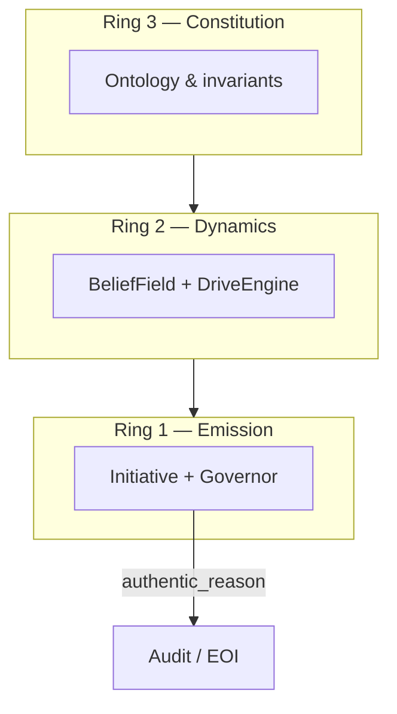

# Endogenous Initiative Architecture (EIA)

**Program name:** **Endogenous Initiative Architecture (EIA)**  
**Legacy / benchmark prefix:** PROACTIVE AI · **PAI-EI** benchmark

Research platform for AI systems with **endogenous initiative** (P4–P5 proactivity) — the ability to form internal reasons, questions, and bounded actions without a current human request, based on memory, sensory context, uncertainty, and a value model.

**Status:** v0.1 — architecture specification (prototype in development)  
**Implementation plan:** [`docs/IMPLEMENTATION_PLAN.md`](./docs/IMPLEMENTATION_PLAN.md)

---

## Overview

| File / directory | Purpose |
|---|---|
| [`PROACTIVE_AI_Endogenous_Initiative_Architecture_EN_v0.1.md`](./PROACTIVE_AI_Endogenous_Initiative_Architecture_EN_v0.1.md) | Full architecture specification |
| [`docs/IMPLEMENTATION_PLAN.md`](./docs/IMPLEMENTATION_PLAN.md) | Implementation & development plan (R0–R11, MVP-0–3, repo strategy) |
| [`docs/AGENT_STATE.md`](./docs/AGENT_STATE.md) | Typed agent state `X_t` — fuzzy set → formal schema |
| [`docs/RING_ARCHITECTURE.md`](./docs/RING_ARCHITECTURE.md) | Ring 1-2-3: Emission ↔ Dynamics ↔ Constitution |
| [`docs/NAMM_INTEGRATION.md`](./docs/NAMM_INTEGRATION.md) | Integration with [NAMM experiments](https://github.com/errorlogy/namm-experiments) |
| [`experiments/PAI-EI-E0-001/`](./experiments/PAI-EI-E0-001/) | First experiment scaffold (Twin World Test) |
| [`.env.example`](./.env.example) | Environment variable template for future implementation |

### Related research (Anthemium lineage)

| Program | Repository | Role |
|---------|------------|------|
| **NAMM** | [errorlogy/namm-experiments](https://github.com/errorlogy/namm-experiments) | Verification-first machine-native math discovery |
| **EIA** (PROACTIVE AI) | this repo → [`errorlogy/eia`](https://github.com/errorlogy/eia) | Endogenous initiative architecture (P4–P5) |

Both programs share falsifiable gates, causal traces, and experiment manifests under the [Anthemium](https://anthemium.tech) research frame.

### Architecture (brief)

- **P4–P5 proactivity** — endogenous motives, not timers or request prediction
- **Causal trace** — every contact traced from observation to action
- **Dual-controller** — Contact Governor and Action Governor independent of LLM
- **Phased roadmap** — digital-only MVP-0 → bounded embodiment MVP-3
- **Typed agent state** — fuzzy inner state formalized as `X_t`; see [`docs/AGENT_STATE.md`](./docs/AGENT_STATE.md)
- **Ring architecture** — Constitution (Ring 3) → Dynamics (Ring 2) → Emission (Ring 1); see [`docs/RING_ARCHITECTURE.md`](./docs/RING_ARCHITECTURE.md)



See [architecture specification](./PROACTIVE_AI_Endogenous_Initiative_Architecture_EN_v0.1.md) §5, §7, §26–27.

### Quick start (MVP-0)

```powershell
pip install -e ".[dev]"
eia demo
eia replay --trace traces/<trace_id>.jsonl
pytest tests/ -v
```

See [`DEMO.md`](./DEMO.md) for causal walkthrough of what `eia demo` produces.

### Quick start (NAMM sibling clone)

```powershell
git clone https://github.com/errorlogy/namm-experiments.git ..\namm-experiments
cd ..\namm-experiments
python -m pip install -e ".[dev,nd]"
python -m pytest tests/ -v
```

Integration details: [`docs/NAMM_INTEGRATION.md`](./docs/NAMM_INTEGRATION.md).

---

## Prerequisites

- **Python 3.12+** — `pip install -e ".[dev]"` then `eia demo`
- **Git** — version control

At documentation-only stage, no database or API keys required for MVP-0 demo.

For future MVP-1+:
- **PostgreSQL 15+** (pgvector optional) — state and memory
- **Docker / Docker Compose** — local lab
- **Git** — version control

Optional (MVP-1+): NATS/Kafka, Temporal, Vault, OpenTelemetry.

NAMM requires **Python 3.12+** — see [namm-experiments README](https://github.com/errorlogy/namm-experiments).

---

## Environment

Copy `.env.example` to `.env` when implementation begins. `.env` is **not committed**.

| Group | Purpose |
|---|---|
| `LLM_*`, `OPENAI_API_KEY` | Cognitive core provider |
| `POSTGRES_*`, `DATABASE_URL` | State and memory |
| `CONTACT_*` | Proactive contact limits (safety) |
| `SIMULATOR_*`, `CAUSAL_TRACE_*` | Research simulator mode |
| `OTEL_*` | Tracing and observability |

---

## Security

- Store secrets only in `.env` or external vault (HashiCorp Vault / KMS)
- Do not commit API keys, passwords, certificates, or DB dumps
- Before push: `git status` must not show `.env`, `node_modules/`, `venv/`, etc.

---

## Author

**Roman Kuznetsov**

- Site: [anthemium.tech](https://anthemium.tech)
- X: [@AGIminister](https://x.com/AGIminister)
- Repository: [github.com/errorlogy/eia](https://github.com/errorlogy/eia)

---

## License

This work is licensed under [Creative Commons Attribution 4.0 International (CC BY 4.0)](./LICENSE).

**Attribution requirement:** If you use, adapt, or build upon this research, you must cite the **Endogenous Initiative Architecture (EIA)** research program and link to this repository. If you use the NAMM integration path, also cite [errorlogy/namm-experiments](https://github.com/errorlogy/namm-experiments).

For academic and software citation, see [`CITATION.cff`](./CITATION.cff).

```bibtex
@software{kuznetsov2026eia,
  author = {Kuznetsov, Roman},
  title = {Endogenous Initiative Architecture (EIA)},
  year = {2026},
  url = {https://github.com/errorlogy/eia},
  note = {Research program on proactive AI with endogenous initiative}
}
```

---

## Contributing

Early-stage repository. Coordinate architecture changes with specification version (currently v0.1).
