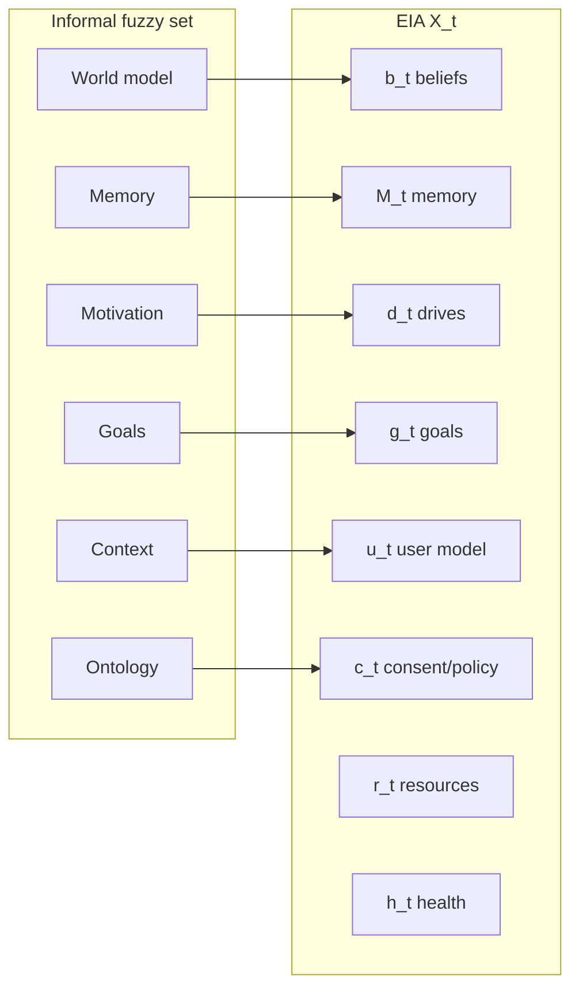
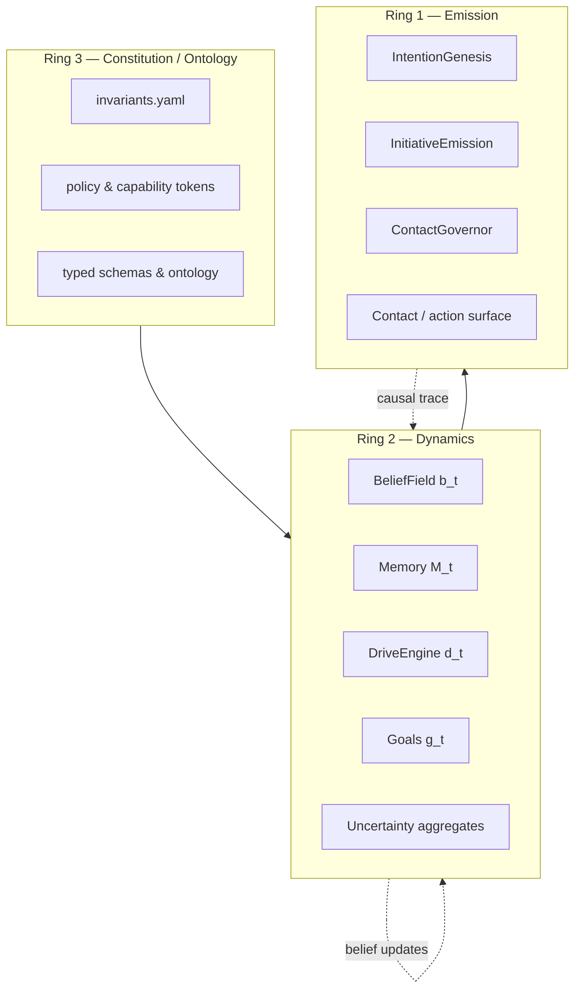
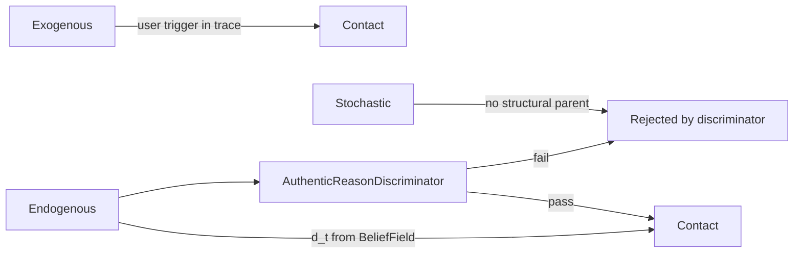
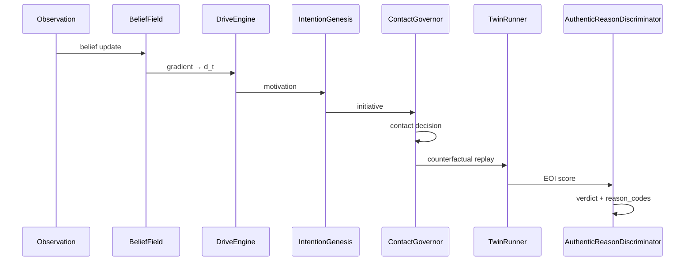

# Agent State Schema — From Fuzzy Set to Typed `X_t`

**Author:** Roman Kuznetsov · [anthemium.tech](https://anthemium.tech) · [@AGIminister](https://x.com/AGIminister)  
**Program:** Endogenous Initiative Architecture (EIA) v0.1  
**Implementation:** [`src/eia/schemas/agent_state.py`](../src/eia/schemas/agent_state.py)

---

## 1. Problem: the fuzzy inner state

Informal descriptions of agent cognition often collapse into a **fuzzy set** — overlapping, underspecified blobs:

| Informal term | Typical misuse |
|---|---|
| **Motivation** | LLM mood or self-report ("I became curious") |
| **Goals** | Prompt instructions or hidden system goals |
| **World model** | Raw context window without provenance |
| **Context** | Undifferentiated chat history |
| **Memory** | Vector store hits without causal links |
| **Ontology** | Ad-hoc JSON the model invented mid-turn |

EIA rejects this. Inner state must be **typed, persistent, and causally addressable** — not a narrative overlay on token prediction.

---

## 2. Formal model: `X_t`

At discrete time `t`, agent inner state is:

\[
X_t = \{b_t, M_t, d_t, g_t, u_t, c_t, r_t, h_t\}
\]

| Symbol | Name | Fuzzy-set mapping | MVP-0 artifact |
|---|---|---|---|
| \(b_t\) | Beliefs | World model | `BeliefField` / `Belief` nodes |
| \(M_t\) | Memory | Episodic + semantic memory | `BeliefUpdate` log, trace refs |
| \(d_t\) | Drives | Motivation (structural) | `DriveEngine` → `Motivation` |
| \(g_t\) | Goals | Goals, commitments | `BeliefKind.COMMITMENT`, active intentions |
| \(u_t\) | User/relationship | Context (social) | Observation user-model features |
| \(c_t\) | Consent/policy | Ontology (normative layer) | `constitution/invariants.yaml`, capability state |
| \(r_t\) | Resource budget | Contact/context limits | `ContactGovernor` budget, cooldown |
| \(h_t\) | Health | System integrity | Sensor/clock/memory health flags |

**Pydantic bundle:** `AgentState` in code maps these fields to a single serializable snapshot used by audit and replay.



---

## 3. Ring architecture (1–2–3)

Rings separate **constitution**, **dynamics**, and **emission**. Initiative flows inward-out; audit flows outward-in.



| Ring | Role | Must not |
|---|---|---|
| **3** | Immutable constraints, schema, ontology | Be rewritten by LLM mid-episode |
| **2** | Belief updates, drives, memory, goal tension | Emit contact directly |
| **1** | Candidate selection, governor clearance, emission | Compute drives without typed state |

See also: [`RING_ARCHITECTURE.md`](./RING_ARCHITECTURE.md).

---

## 4. Initiative classes: exogenous vs endogenous vs stochastic

| Class | Causal origin | Operational test | Example |
|---|---|---|---|
| **Exogenous** | Recent user command or external rule | Initiative disappears when user trigger removed; EOI ≈ 0 | "User asked about deadline" → same question |
| **Endogenous** | Structural drive from \(b_t, d_t, g_t\) | Survives `do(remove user trigger)`; EOI above threshold; structural drive chain | Contradiction in BeliefField → epistemic question without prompt |
| **Stochastic** | RNG, temperature, or untyped LLM drift | No stable causal chain; fails drive structural check | Random clarifying question every N ticks |



---

## 5. Operational definition: authentic reason

An initiative has an **authentic reason** (endogenous, auditable) iff **all** checks pass:

1. **Causal chain** — trace contains `observation → belief_update → motive → intention → governor`.
2. **Structural drive** — dominant motive derives from BeliefField gradients (`error_term`), not narrative self-report.
3. **EOI threshold** — counterfactual twin run yields Endogenous Origin Index ≥ θ (default 0.5).
4. **Governor pass** — Contact Governor approved (`SEND_NOW` or routed `INTERNAL_RESEARCH`), not spam-denied.
5. **Anti-spam** — within daily budget, cooldown satisfied, not fatigue-blocked random contact.

**Implementation:** [`src/eia/audit/authentic_reason.py`](../src/eia/audit/authentic_reason.py) → `AuthenticReasonDiscriminator`.



---

## 6. Code reference

```python
from eia.schemas.agent_state import AgentState
from eia.audit.authentic_reason import AuthenticReasonDiscriminator

# Snapshot at tick t
state = AgentState.from_cognitive_loop(loop, trace_id=loop.trace.trace_id)

# After contact + twin run
verdict = AuthenticReasonDiscriminator().evaluate(
    trace=loop.trace,
    motivation=motivation,
    initiative=initiative,
    decision=decision,
    eoi=twin_result.eoi,
    governor_state=loop.governor.state,
)
```

---

## 7. Related documents

| Document | Content |
|---|---|
| [Architecture spec §7](../PROACTIVE_AI_Endogenous_Initiative_Architecture_EN_v0.1.md) | Full formal model |
| [RING_ARCHITECTURE.md](./RING_ARCHITECTURE.md) | Ring 1-2-3 diagram and invariants |
| [IMPLEMENTATION_PLAN.md](./IMPLEMENTATION_PLAN.md) | R0–R11 roadmap |
| [NAMM CCT — proto-subject & class mode](../../docs/COGNITIVE_CLASS_TAXONOMY.md) | AI agent projection onto K0–K7 / K_AI manifold; class mode switching (§4.1–4.3, H-CCT-011–014) |
