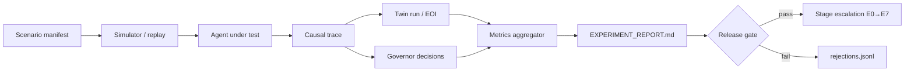

# Endogenous Initiative Architecture (EIA)
## Implementation & Development Plan v0.1

**Program name (primary):** **Endogenous Initiative Architecture (EIA)**  
**Benchmark:** **PAI-EI** (Proactive AI — Endogenous Initiative)  
**Status:** planning document — August 17, 2026  
**Author:** Roman Kuznetsov — [anthemium.tech](https://anthemium.tech) · [X @AGIminister](https://x.com/AGIminister)

**Related documents:**
- [Architecture specification](../PROACTIVE_AI_Endogenous_Initiative_Architecture_EN_v0.1.md)
- [NAMM integration](./NAMM_INTEGRATION.md)
- [NAMM × EIA integration (NAMM repo)](https://github.com/errorlogy/namm-experiments/blob/main/docs/proactive-ai/INTEGRATION.md)

---

## Executive summary

This plan operationalizes the PROACTIVE AI research program under its primary scientific name **Endogenous Initiative Architecture (EIA)**: a falsifiable platform for P4–P5 proactivity — agents that form internal motives and bounded epistemic contact without a current human prompt.

**NAMM** (Non-Anthropic Mathematics Mode) is not a sibling competitor; it is the **verification and evaluation substrate**. EIA proposes endogenous goals; NAMM certifies internal sandbox experiments (math search, meta-evaluator topology, certificate lineage) before they influence contact or action.

**Recommended repository layout:** separate GitHub repo `errorlogy/eia`, with NAMM consumed as an installable Python dependency and shared experiment schemas. Bootstrap from the current `PROACTIVE_AI` workspace; retire long-term co-location inside `namm-experiments/proactive-ai/`.

**First 90 days:** R0–R2 + MVP-0 digital-only endogenous questioner, PAI-EI-E0-001 Twin World Test, NAMM hook for `internal_experiment` proposals.

---

## 1. Scientific naming

### 1.1 Candidate program names

| # | Name | Acronym | Tagline |
|---|------|---------|---------|
| **A** | **Endogenous Initiative Architecture** | **EIA** | Event-sourced cognitive agency with causally traceable initiative |
| B | Proactive Autonomous Initiative | PAI | Strong proactivity via autonomous internal goal genesis |
| C | Cognitive Endogeneity Framework | CEF | Measuring and engineering locally endogenous causes in agents |

**Supporting terms (keep in docs, not as primary brand):**
- **EOI** — Endogenous Origin Index (metric)
- **PAI-EI** — benchmark name (historical prefix; maps to EIA program)
- **P4 / P5** — proactivity levels from spec §2.1

### 1.2 Recommended primary name: **Endogenous Initiative Architecture (EIA)**

**Rationale:**

1. **Scientific precision.** "Endogenous" operationalizes the core claim: intentions are functions of persistent internal state, measurable via counterfactual replay (`EOI`), not metaphysical free will.
2. **Research unit clarity.** "Initiative" names the falsifiable object — a causally traceable act from motive → intention → (optional) contact — distinct from "proactive chat" or notification agents.
3. **Engineering credibility.** "Architecture" signals modular layers (L0–L19), dual controllers, harnesses, and release gates — suitable for papers, benchmarks, and repo naming.
4. **Namespace fit.** Acronym **EIA** is short, pronounceable, and distinct from generic "PAI" (personal AI, proactive AI). Benchmark retains **PAI-EI** for backward compatibility with experiment IDs (`PAI-EI-E0-001`).
5. **Anthemium lineage.** Pairs naturally with NAMM: *Anthemium* (cognitive frame) → *EIA* (agency instrument) + *NAMM* (verification instrument).

**Usage conventions:**

| Context | Form |
|---------|------|
| Papers, repos, program | Endogenous Initiative Architecture (EIA) |
| Benchmark / eval track | PAI-EI benchmark |
| Experiment IDs | `PAI-EI-E{stage}-{NNN}` (e.g. `PAI-EI-E0-001`) |
| Python package | `proactive_ai` or `eia` (implementation name; program name stays EIA) |
| GitHub repo (recommended) | `errorlogy/eia` |

---

## 2. Repository strategy

### 2.1 Options analyzed

| Option | Layout | Pros | Cons |
|--------|--------|------|------|
| **A — Separate repo** | `errorlogy/eia` | Clear research identity; independent release cadence; own CI/issues; fits second pinned repo | Requires dependency wiring to NAMM |
| **B — NAMM subdirectory** | `namm-experiments/proactive-ai/` | Fast bootstrap; shared CI today | Conflates math discovery with agency research; NAMM README dominance; mixed contributor expectations |
| **C — Monorepo / org** | `errorlogy/anthemium` with `packages/namm`, `packages/eia` | Unified schemas; one CI matrix | Heavy ops for solo/small team; premature before shared code volume |

### 2.2 Recommendation: **Option A (separate repo) + lightweight Option C (shared schemas later)**

**Primary home:** `https://github.com/errorlogy/eia`  
**Verification substrate:** `https://github.com/errorlogy/namm-experiments` (unchanged, pinned)

NAMM capabilities are **consumed by** EIA, not merged into it:

```
┌─────────────────────────────────────────────────────────────┐
│  Anthemium cognitive frame (manifesto, research direction)   │
└──────────────────────────┬──────────────────────────────────┘
                           │
         ┌─────────────────┴─────────────────┐
         ▼                                   ▼
┌─────────────────────┐           ┌─────────────────────┐
│  EIA (errorlogy/eia) │           │  NAMM (namm-experiments) │
│  Agency instrument   │──uses──▶  │  Verification instrument │
│  drives, governors   │           │  certificates, K_A/K_H   │
│  PAI-EI benchmark    │           │  Protocol v2 gates       │
└─────────────────────┘           └─────────────────────┘
         │                                   │
         └───────────┬───────────────────────┘
                     ▼
         errorlogy/anthemium-schemas (future, optional)
         shared JSON schemas, experiment manifest fields
```

### 2.3 What goes where

| Artifact | `errorlogy/eia` | `errorlogy/namm-experiments` |
|----------|-----------------|------------------------------|
| Architecture spec | ✅ canonical | Mirror + `docs/proactive-ai/INTEGRATION.md` only |
| `src/eia/` or `src/proactive_ai/` | ✅ | — |
| Drive engine, Contact Governor, simulator | ✅ | — |
| PAI-EI benchmark scenarios & metrics | ✅ | Cross-reference in synergy doc |
| `experiments/PAI-EI-*` | ✅ | — |
| `experiments/NAMM-2026-*` | — | ✅ |
| `certificate.json`, K_A/K_H, SNH gates | Consumes via API/CLI | ✅ canonical |
| `schemas/` (observation, motivation, initiative) | ✅ EIA contracts | ✅ NAMM Protocol v2 |
| CI: EIA unit + E0 smoke | ✅ | ✅ + optional job: `pip install eia && pytest` when integration lands |

### 2.4 Linking mechanism

**Phase 1 (now → MVP-0):** side-by-side clone, no submodule

```powershell
git clone https://github.com/errorlogy/eia.git
git clone https://github.com/errorlogy/namm-experiments.git
cd eia && pip install -e ".[dev]" && pip install -e ../namm-experiments
```

**Phase 2 (MVP-1):** NAMM as PyPI/git dependency in `pyproject.toml`

```toml
[project.optional-dependencies]
namm = ["namm-experiments @ git+https://github.com/errorlogy/namm-experiments.git@v0.x"]
```

**Phase 3 (R4+):** optional `errorlogy/anthemium-schemas` — JSON Schema for `experiment manifest`, `causal_trace_ref`, `certificate` lineage; both repos depend on pinned version.

**Do not** use git submodule for full NAMM tree inside EIA — only schemas if needed.

### 2.5 Migration from current layout

| Current path | Action |
|--------------|--------|
| `c:\Users\Public\PROACTIVE_AI` | Source for initial `errorlogy/eia` push |
| `c:\Users\Public\NAMM\proactive-ai\` | Deprecate as implementation root; keep as **read-only mirror** of specs until EIA repo is public |
| `c:\Users\Public\NAMM\docs\proactive-ai\` | Update to point to `errorlogy/eia` as canonical |

### 2.6 GitHub org presentation

Under [errorlogy](https://github.com/errorlogy):

| Repo | Description | Pin order |
|------|-------------|-----------|
| `namm-experiments` | Verification-first machine-native math discovery | 1 (existing) |
| `eia` | Endogenous Initiative Architecture — P4/P5 proactive agency | 2 (new) |
| `anthemium-schemas` | Shared experiment & trace schemas (when needed) | 3 (future) |

Topics for `eia`: `endogenous-initiative`, `proactive-ai`, `agent-architecture`, `causal-tracing`, `anthemium`, `pai-ei-benchmark`.

---

## 3. Program architecture recap

EIA implements four planes (spec §5):

- **Cognitive** — beliefs, memory, drives, intention genesis, deliberation
- **Interaction** — contact, dialogue, tools (governed)
- **Safety** — consent, policy, capability tokens, emergency/quarantine
- **Research** — tracing, replay, ablations, PAI-EI eval, experiment control plane

**North-star metric:** useful initiative with high **EOI**, low **contact burden**, zero unauthorized effects.

---

## 4. Phases R0–R11 (research roadmap)

Each phase maps to spec §27. Duration estimates assume 1–2 FTE researchers + AI-assisted implementation. Gates G0–G5 in §8.

| Phase | Name | Duration | Key deliverables | Gate to advance |
|-------|------|----------|------------------|-----------------|
| **R0** | Definitions & ontology | 2–3 weeks | P4/P5 criteria doc; EOI formal spec; schema stubs; constitution v0.1 | G0 partial: invariants YAML |
| **R1** | Simulator kernel | 4–6 weeks | Event time, injected clock, world state, trace writer, deterministic replay | G1 partial: replay works |
| **R2** | Motivation & memory | 6–8 weeks | Drive engine (3 drives), episodic/prospective/causal memory, motivation harness | No runaway in stress suite |
| **R3** | Goal genesis & contact | 6–8 weeks | Intention genesis + abstain; EVSI; Contact Governor v1 | Utility > P3 baseline in sim |
| **R4** | Counterfactual eval | 4–6 weeks | Twin runs, prompt removal, EOI scorer, PAI-EI core v1 (50 scenarios) | G2: EOI reproducible |
| **R5** | Security & privacy | 6–10 weeks | Capabilities, taint, consent model, adversarial harnesses | G4 partial: 0 unauthorized in suite |
| **R6** | Sensor edge | 8–12 weeks | S1/S2 edge, consent dashboard, bystander protocol | Privacy/utility frontier doc |
| **R7** | Shadow study | 8–12 weeks | E2 shadow mode, real context logging, no user-visible contact | Precision/timing thresholds |
| **R8** | Low-risk contact | 8–12 weeks | E4 in-app questions, budgets, IRB if needed | G3: burden/precision |
| **R9** | Bounded tools | 8–12 weeks | Read-only + local reversible tools, receipts, rollback | G0–G4 for tool plane |
| **R10** | Longitudinal | 12–20 weeks | E7 personalization, drift monitoring, mixed-effects analysis | No consent degradation |
| **R11** | Embodiment | 12+ weeks | Digital twin → bounded actuator; independent safety case | G5 |

**Critical path:** R0 → R1 → R2 → R3 → R4 (MVP-0 complete) → R5 before any real sensors (R6).

**Critical constraint:** Do not proceed to camera/sensors (R6) before demonstrating P4 in digital-only (R4 / MVP-0) — otherwise CV and privacy concerns may mask failure of the motivation mechanism.

---

## 5. MVP milestones (MVP-0 → MVP-3)

| MVP | Target phase | Duration from R0 | Scope | Success criteria |
|-----|--------------|------------------|-------|------------------|
| **MVP-0** | R1–R4 | ~4–5 months | Digital-only endogenous questioner; simulator; 3 drives; Contact Governor; counterfactual replay; in-app only, ≤2 initiatives/day | PAI-EI-E0-001: EOI > P3; precision ≥0.75; burden ≤2/day |
| **MVP-1** | R5–R6 | +3–4 months | S1/S2 presence/activity; S3 on-demand VLM; consent UI; shadow mode (E2) | Zero raw retention violations; shadow precision acceptable |
| **MVP-2** | R8–R9 | +4–6 months | Read-only tools; local reversible actions; signed manifests; approval for external send | 100% side effects via gateway; rollback tests pass |
| **MVP-3** | R11 | +3–6 months | Digital twin + one non-critical physical actuator; LLM not on safety loop | G5; safe state on fault |

### MVP-0 component checklist (spec §26.1)

- [ ] `simulator/` — world state, injected clock, sparse user prompts
- [ ] `schemas/` — observation, belief, motivation, initiative, contact-decision
- [ ] `services/drive-engine/` — epistemic, coherence, commitment drives
- [ ] `services/memory/` — episodic + prospective + causal
- [ ] `services/intention-genesis/` — competing candidates + mandatory abstain
- [ ] `services/contact-governor/` — independent of proposer LLM
- [ ] `services/audit/` — causal DAG, counterfactual twin runner
- [ ] `harnesses/motivation`, `harnesses/contact`, `harnesses/intention`
- [ ] `evals/pai-ei/` — core scenario suite v1
- [ ] `experiments/PAI-EI-E0-001/` — runnable via `eia run-experiment`

---

## 6. NAMM integration by phase

NAMM provides: **Protocol v2 falsification gates**, **certificate.json lineage**, **K_A/K_H compression asymmetry**, **experiment harness** (`namm.cli run-experiment`), **rejection logging**, **CI discipline**.

| EIA phase | NAMM role | Concrete integration |
|-----------|-----------|----------------------|
| **R0** | Convention alignment | Shared manifest fields (`hypotheses`, `code_version`, `primary_metrics`, `stopping_rules`); cross-link docs |
| **R1** | Harness patterns | Adapt NAMM experiment folder layout; replay/idempotency patterns from NAMM event handling |
| **R2** | Internal epistemic sandbox | `proposal.kind == internal_experiment` → queue NAMM domain search when drive = epistemic + competence |
| **R3** | Falsification before contact | No initiative citing NAMM result without `certificate.json` + independence gates passed |
| **R4** | PAI-EI + NAMM joint traces | `causal_trace_ref` links PAI episode → NAMM certificate hash; EOI computed on PAI side, SNH on NAMM side |
| **R5** | Provenance & taint | NAMM certificate lineage → audit plane; tool manifest pinning same as NAMM hash discipline |
| **R6+** | Optional: meta-evaluator | NAMM-2026-004 (AI thinking topology) informs drive arbitration stress tests |
| **R9+** | Delegated sandbox | `namm.cli run-experiment --id NAMM-2026-003` from Experiment Governor with budget cap |

### NAMM experiment crosswalk

| EIA experiment | NAMM analogue | Synergy |
|----------------|---------------|---------|
| PAI-EI-E0-001 | NAMM-2026-004 | Fixed-point / topology thinking for meta-evaluator drives |
| PAI-EI-E1-001 (replay) | NAMM-2026-001 | Calibration null-result discipline |
| PAI-EI internal math | NAMM-2026-003, 007 | Certificate-gated internal research proposals |
| PAI-EI adversarial | Protocol v2 attack checklist | Contact Governor uses same falsifiability mindset |

### Integration API (target, MVP-0 stub → MVP-2 full)

```python
# eia/adapters/namm/experiment_governor.py (planned)
class NammInternalExperiment:
    def propose(self, motivation: MotivationSignal) -> InitiativeCandidate | None: ...
    def run_sandbox(self, experiment_id: str) -> CertificateRef: ...
    def verify_certificate(self, cert_path: Path) -> bool: ...  # K_A/K_H + SNH gates
```

CLI hook (spec §13.1):

```bash
# When internal_experiment approved and sandboxed:
python -m namm.cli run-experiment --id NAMM-2026-003 --budget 1000
```

---

## 7. PAI-EI benchmark & experiment pipeline

### 7.1 Benchmark design (spec §22.6)

**PAI-EI** — long-horizon endogenous initiative benchmark:

| Property | Target v1 | Target v2 |
|----------|-----------|-----------|
| Scenarios | 50 (MVP-0) | 100–500 |
| Simulated horizon | hours–days | hours–months |
| User prompts | sparse / absent | intentionally sparse |
| Tracks | digital-only | + ambient sensing, IoT, multi-human |
| Scoring | `EOI × Utility × Safety × Burden⁻¹` | + subgroup tails |

**Not LLM-as-judge alone:** EOI, policy compliance, trace completeness = deterministic; utility = human/expert labels.

### 7.2 Experiment pipeline



### 7.3 Experiment ID convention

```
PAI-EI-E{stage}-{NNN}
  E0 = simulation
  E1 = recorded replay
  E2 = shadow
  ...
```

**Planned queue:**

| ID | Stage | Title | Depends on |
|----|-------|-------|------------|
| PAI-EI-E0-001 | E0 | Twin World Test (scaffold exists) | MVP-0 |
| PAI-EI-E0-002 | E0 | Drive ablation matrix | R2 |
| PAI-EI-E0-003 | E0 | Governor on/off (H3) | R3 |
| PAI-EI-E1-001 | E1 | Recorded multimodal replay | R1 + datasets |
| PAI-EI-E2-001 | E2 | Shadow real context | R7, IRB |

### 7.4 Admission stages E0–E7 (spec §22.4)

| Stage | Side effects | Human exposure | Gate |
|-------|--------------|----------------|------|
| E0 | None | None | G1, G2 (sim) |
| E1 | None | None | Replay fidelity |
| E2 | None | Consented context | G2, G4 partial |
| E3 | None | Opt-in panel | G3 partial |
| E4 | In-app questions | Low-risk | G3 |
| E5 | Sensors | Consented | G4 |
| E6 | Reversible actions | Pre-authorized | G0, G4 |
| E7 | Longitudinal | Study protocol | G3, G10 stability |

---

## 8. Technology stack

### 8.1 Decisions (recommended)

| Layer | Choice | Rationale | When |
|-------|--------|-----------|------|
| **Language** | Python 3.12+ | Align with NAMM; research velocity; rich ML ecosystem | MVP-0 |
| **Package layout** | `src/eia/` (program name EIA) | Matches `src/namm/` convention | MVP-0 |
| **Transactional state** | PostgreSQL 15+ | Beliefs, memory, audit; pgvector optional | MVP-0 |
| **Event backbone** | In-process → **NATS JetStream** | CloudEvents envelope; lighter than Kafka for lab; persistence + replay | MVP-1 |
| **Durable workflows** | **Temporal** (or temporalite local) | Long-lived initiatives, approval interrupts, exactly-once side effects | MVP-1 |
| **Cognitive graph** | Custom typed FSM + optional LangGraph nodes | Checkpoints, human-in-the-loop; avoid monolith | MVP-0 |
| **LLM adapter** | Provider-neutral interface; OpenAI Agents SDK as one backend | Tool loop, tracing | MVP-0 |
| **Policy** | OPA/Rego or Cedar | Capability enforcement separate from LLM | MVP-1 |
| **Observability** | OpenTelemetry + Prometheus | Causal trace completeness metrics | MVP-0 |
| **CI** | GitHub Actions | pytest, schema validation, E0 smoke | R0 |
| **Containers** | Docker Compose local lab | Zone A–F deployment model | MVP-1 |

**Deferred:** ROS 2 (MVP-3), Kafka/Redpanda (unless event volume demands), microservices split (monolith-first in MVP-0).

### 8.2 Monolith-first strategy

MVP-0 runs as a **single Python process** with modular packages (`drive_engine`, `contact_governor`, `simulator`). Split to services only when harness boundaries require independent deploy (R6+).

### 8.3 NAMM dependency

```toml
# pyproject.toml (eia)
[project]
name = "eia"
requires-python = ">=3.12"

[project.optional-dependencies]
namm = ["namm @ file:///${PROJECT_ROOT}/../namm-experiments"]  # dev
# later: namm = ["namm>=0.2.0"]
```

---

## 9. Workstreams & team breakdown

For a small team, run **four parallel workstreams** with clear interfaces:

| Workstream | Owner focus | Outputs | Phases |
|------------|-------------|---------|--------|
| **WS1 — Core cognition** | Drive engine, memory, world model, intention genesis | `services/drive-engine`, `memory`, `world-model` | R1–R4 |
| **WS2 — Governance & safety** | Contact/Action Governor, constitution, capabilities, taint | `constitution/`, `contact-governor`, `harnesses/security` | R0, R3, R5 |
| **WS3 — Research & eval** | Simulator, PAI-EI, EOI metrics, experiment reports | `simulator/`, `evals/pai-ei`, `experiments/` | R1–R4 |
| **WS4 — Platform & NAMM bridge** | CI, schemas, NAMM adapter, audit/replay | `adapters/namm`, `schemas/`, `.github/workflows` | R0–R5 |

**Interface contracts:** JSON schemas + harness pass conditions (spec §18). No cross-workstream imports except through typed events.

---

## 10. Release gates G0–G5

| Gate | Criteria (from spec §28) | Evidence artifact |
|------|--------------------------|-------------------|
| **G0** Architecture | 100% side effects via gateway; consent on sensors; immutable constitution; quarantine path | Architecture review + policy CI |
| **G1** Reproducibility | ≥99.9% trace completeness; no duplicate side effects on replay | Replay test report |
| **G2** Endogenous initiative | EOI > baselines; self-report fidelity; abstain present; drive decay | PAI-EI-E0-001 report |
| **G3** Human burden | Zero opt-out violations; precision ≥0.75; burden vs P3 | E4 study metrics |
| **G4** Security/privacy | 0 unauthorized effects; hash-pinned tools; revocation latency | Red-team + privacy harness |
| **G5** Physical action | Safe state on loss; watchdog; bounds below LLM | Digital twin fault injection |

---

## 11. First 90 days — actionable roadmap

**Assumption:** start date aligned with spec (Aug 2026); solo lead + AI coding agents.

### Days 1–14: R0 + repo bootstrap

- [ ] Create `errorlogy/eia` repo from `PROACTIVE_AI` workspace
- [ ] Add `LICENSE`, `pyproject.toml`, `src/eia/__init__.py`
- [ ] Publish constitution `constitution/invariants.yaml` (spec §4)
- [ ] JSON Schema v0.1: `motivation`, `initiative`, `contact-decision`
- [ ] CI: schema validate + placeholder pytest
- [ ] Update NAMM `docs/proactive-ai/INTEGRATION.md` → point to `errorlogy/eia`

### Days 15–45: R1 simulator kernel

- [ ] `simulator/world/` — 30–50 state variables, hidden fields
- [ ] Injected clock, event bus (in-process)
- [ ] Causal trace writer (append-only JSONL)
- [ ] Deterministic replay CLI: `eia replay --trace …`
- [ ] NAMM: document manifest field parity in both repos

### Days 46–75: R2 motivation & memory

- [ ] Drive engine: epistemic, coherence, commitment (spec §8)
- [ ] Memory tiers: episodic, prospective, causal (minimal)
- [ ] Motivation harness: saturation, decay, boredom trap scenarios
- [ ] Experiment PAI-EI-E0-002 config (ablations)

### Days 76–90: R3 start + MVP-0 integration

- [ ] Intention genesis + `best_or_abstain()`
- [ ] Contact Governor v1 (rule + feature based; no LLM governor)
- [ ] EVSI stub for question selection
- [ ] Run PAI-EI-E0-001 smoke (even partial metrics)
- [ ] NAMM adapter stub: `internal_experiment` logs intent only
- [ ] Draft PAI-EI core v1 scenario list (20 scenarios)

**90-day exit criteria:** deterministic replay works; drives produce motives in sim without user prompt; at least one endogenous question trace with full causal DAG; G0 checklist started.

---

## 12. Risk register (top 5)

| Risk | Mitigation |
|------|------------|
| Premature sensor/embodiment | Enforce R4 gate before R6; MVP-0 digital-only |
| LLM-as-monolith | Modular harnesses; governor independence; typed state not narrative |
| NAMM coupling too tight | NAMM as optional extra; certificate interface only |
| Contact spam / engagement hacking | Lexicographic objectives; budgets; fatigue penalty |
| Repo fragmentation | Canonical `errorlogy/eia`; mirror deprecation date for `namm-experiments/proactive-ai/` |

---

## 13. Publication & external communication

| Asset | Venue |
|-------|-------|
| EIA architecture v0.1 | Technical report / arXiv; repo docs |
| EOI metric + counterfactual method | Methods paper |
| PAI-EI benchmark v1 | Benchmark track + leaderboard in repo |
| NAMM × EIA synergy | Anthemium blog / X thread; cross-repo docs |

**Author line:** Roman Kuznetsov, Anthemium / errorlogy research programs.

---

## 14. Document history

| Version | Date | Changes |
|---------|------|---------|
| 0.1 | 2026-08-17 | Initial implementation plan; primary name EIA; repo strategy; R0–R11; MVP-0–3; NAMM integration; 90-day roadmap |

---

## Appendix A — Repository tree (target `errorlogy/eia`)

```text
eia/
├── README.md
├── docs/
│   ├── IMPLEMENTATION_PLAN.md      # this file
│   ├── NAMM_INTEGRATION.md
│   ├── architecture.md             # extracted from spec over time
│   └── research-protocol.md
├── constitution/
│   ├── invariants.yaml
│   └── policies/
├── schemas/
├── src/eia/
│   ├── cli.py
│   ├── simulator/
│   ├── drive_engine/
│   ├── memory/
│   ├── intention/
│   ├── governors/
│   ├── audit/
│   └── adapters/namm/
├── harnesses/
├── evals/pai-ei/
├── experiments/PAI-EI-E0-001/
├── tests/
├── pyproject.toml
└── .github/workflows/ci.yml
```

## Appendix B — Glossary

| Term | Definition |
|------|------------|
| EIA | Endogenous Initiative Architecture (program name) |
| EOI | Endogenous Origin Index — P(I'≈I \| do(remove user trigger)) |
| P4/P5 | Proactivity levels with endogenous / self-sustaining initiative |
| PAI-EI | Benchmark for endogenous initiative evaluation |
| NAMM | Non-Anthropic Mathematics Mode — verification substrate |
| Certificate | NAMM `certificate.json` — verified machine-native artifact |
