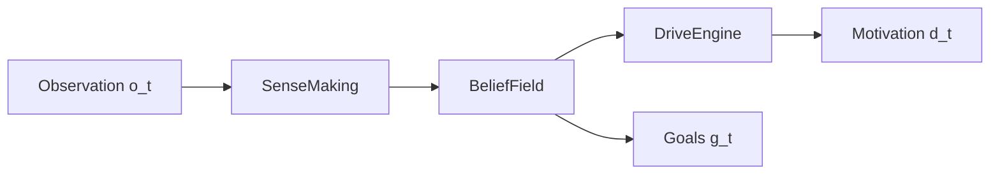
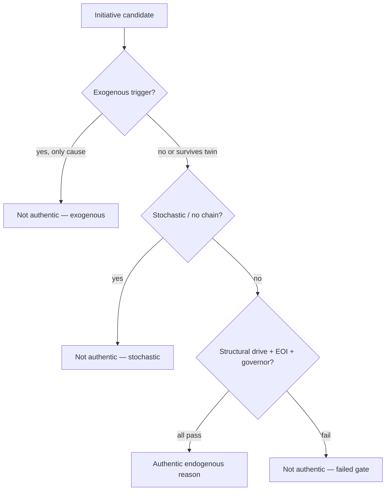

# Ring Architecture — Constitution, Dynamics, Emission

**Author:** Roman Kuznetsov · [anthemium.tech](https://anthemium.tech)  
**See also:** [`AGENT_STATE.md`](./AGENT_STATE.md) · [Architecture spec §5](../PROACTIVE_AI_Endogenous_Initiative_Architecture_EN_v0.1.md)

---

## Overview

EIA organizes agency into three concentric rings. Outer rings constrain inner ones; inner rings never bypass outer clearance.

```mermaid
flowchart TB
    subgraph ring3["🔒 Ring 3 — Constitution / Ontology"]
        direction TB
        C1[System invariants]
        C2[Typed schemas]
        C3[Capability & consent policy]
        C4[Experiment / falsifiability gates]
    end

    subgraph ring2["⚙️ Ring 2 — Dynamics"]
        direction TB
        D1[BeliefField b_t]
        D2[Memory M_t]
        D3[DriveEngine d_t]
        D4[Goals & commitments g_t]
        D5[Uncertainty & contradiction energy]
    end

    subgraph ring1["📡 Ring 1 — Emission"]
        direction TB
        E1[IntentionGenesis]
        E2[InitiativeEmission]
        E3[ContactGovernor / ActionGovernor]
        E4[Human-visible contact]
    end

    ring3 --> ring2
    ring2 --> ring1

    style ring3 fill:#1a1a2e,stroke:#e94560
    style ring2 fill:#16213e,stroke:#0f3460
    style ring1 fill:#0f3460,stroke:#53a8b6
```



---

## Ring 3 — Constitution / Ontology

**Purpose:** Define what the agent *may* become, not what it *currently* believes.

| Component | Location |
|---|---|
| Invariants (no covert sensing, no LLM→actuator) | `constitution/invariants.yaml` |
| Event schemas | `src/eia/schemas/`, `schemas/json/` |
| Contact budgets & quiet hours | `ContactGovernor` config |
| NAMM falsifiability crosswalk | `docs/NAMM_ARTIFACT_CROSSWALK.md` |

**Invariant:** Cognitive core may *propose* policy changes; Ring 3 applies them through governance, never inline.

---

## Ring 2 — Dynamics

**Purpose:** Maintain typed inner state \(X_t\) and structural tensions that *cause* motives.

| Component | Maps to |
|---|---|
| `BeliefField` | \(b_t\) |
| `BeliefUpdate` log | \(M_t\) episodic slice |
| `DriveEngine` | \(d_t\) |
| Commitment beliefs | \(g_t\) |
| `SenseMakingEngine` | observation → belief transition |

**Invariant:** Drives are computed from BeliefField gradients — not from LLM narrative mood.



---

## Ring 1 — Emission

**Purpose:** Select among competing intentions and pass independent governor clearance before any contact.

| Stage | Pipeline enum |
|---|---|
| IntentionGenesis | `INTENTION_GENESIS` |
| InitiativeEmission | `INITIATIVE_EMISSION` |
| ContactGovernor | `CONTACT_GOVERNOR` |
| AuthenticReasonDiscriminator | `AUTHENTIC_REASON` (audit) |

**Invariant:** Governor is structurally separate from proposer — may REJECT even high-EVSI initiatives.

---

## Initiative authenticity flow



| Outcome | Meaning |
|---|---|
| **Exogenous** | User prompt or external rule is necessary cause |
| **Endogenous** | Authentic reason — passes discriminator |
| **Stochastic** | No reproducible structural cause; spam-like |

---

## Cross-ring audit

Every Ring 1 emission must leave a causal trace readable from Ring 2 backward and checkable against Ring 3:

```
observation_ingest → sense_making → motive_formation →
intention_genesis → initiative_emission → contact_governor →
twin_run → eoi_score → authentic_reason
```

Replay: `eia replay --trace traces/<id>.jsonl`
